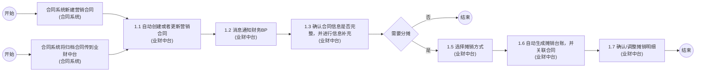
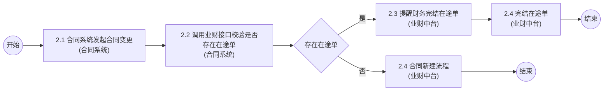
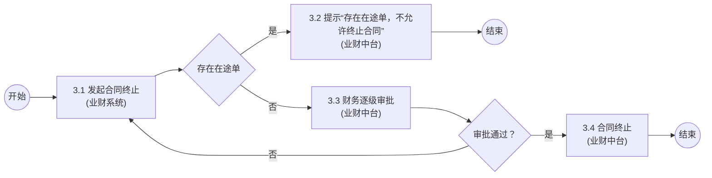

# 3.7.10.1 营销合同管理流程图

## 1. 新增营销合同

### Mermaid 流程图

### 流程节点说明

| 节点编号 | 节点名称 | 角色/部门/系统 | 节点类型 | 说明 |
|---|---|---|---|---|
| - | 开始 | 业务 | 起点 | 流程开始 |
| - | 合同系统新建营销合同 | 业务 / 合同系统 | 操作节点 | - |
| - | 合同系统将归档合同传到业财中台 | 业务 / 合同系统 | 操作节点 | - |
| 1.1 | 自动创建或者更新营销合同 | 业务 / 业财中台 | 操作节点 | - |
| 1.2 | 消息通知财务BP | 财务BP / 业财中台 | 操作节点 | - |
| 1.3 | 确认合同信息是否完整，并进行信息补充 | 财务BP / 业财中台 | 操作节点 | 附加说明：1、核实水/[待人工确认:代]/佣结算，是否有水费等结算，是否对公结算，是否广宣费用，结算对象 2、结算方式，付款节点时间 3、费用类型，费用大小类 |
| - | 需要分摊 | 财务BP | 判断节点 | - |
| 1.5 | 选择摊销方式 | 财务BP / 业财中台 | 操作节点 | 附加说明：1、需要确认摊销方式：期间，次数 2、补充计算逻辑 |
| 1.6 | 自动生成摊销台账，并关联合同 | 财务BP / 业财中台 | 操作节点 | - |
| 1.7 | 确认/调整摊销明细 | 财务BP / 业财中台 | 操作节点 | - |
| - | 结束 | 财务BP | 终点 | 流程结束 |

### 流程分支说明

| 起点 | 条件/操作 | 终点 | 说明 |
|---|---|---|---|
| 需要分摊 | 否 | 结束 | 不需要分摊，流程直接结束 |
| 需要分摊 | 是 | 1.5 选择摊销方式 | 需要分摊，进入选择摊销方式环节 |

### 待确认内容

1. 节点 1.3 的附加说明中，“核实水/[待人工确认:代]/佣结算”字迹模糊，初步识别为“代”，待人工确认。

---

## 2. 变更营销合同

### Mermaid 流程图

### 流程节点说明

| 节点编号 | 节点名称 | 角色/部门/系统 | 节点类型 | 说明 |
|---|---|---|---|---|
| - | 开始 | 业务 | 起点 | 流程开始 |
| 2.1 | 合同系统发起合同变更 | 业务 / 合同系统 | 操作节点 | - |
| 2.2 | 调用业财接口校验是否存在在途单 | 业务 / 合同系统 | 操作节点 | 附加说明：如果不[待人工确认:修改]结算方式、付款计划等信息，则校验通过 |
| - | 存在在途单 | 业务 | 判断节点 | - |
| 2.3 | 提醒财务完结在途单 | 业务 / 业财中台 | 操作节点 | - |
| 2.4 | 合同新建流程 | 业务 / 业财中台 | 操作节点 | 节点编号与下方重复，按原图保留 |
| 2.4 | 完结在途单 | 财务BP / 业财中台 | 操作节点 | 节点编号与上方重复，按原图保留 |
| - | 结束 | 业务 / 财务BP | 终点 | 流程结束 |

### 流程分支说明

| 起点 | 条件/操作 | 终点 | 说明 |
|---|---|---|---|
| 存在在途单 | 否 | 2.4 合同新建流程 | 不存在在途单，进入合同新建流程 |
| 存在在途单 | 是 | 2.3 提醒财务完结在途单 | 存在在途单，提醒财务进行完结处理 |

### 待确认内容

1. 节点 2.2 的附加说明中，“如果不[待人工确认:修改]结算方式”字迹模糊，初步识别为“修改”，待人工确认。

---

## 3. 终止营销合同

### Mermaid 流程图

### 流程节点说明

| 节点编号 | 节点名称 | 角色/部门/系统 | 节点类型 | 说明 |
|---|---|---|---|---|
| - | 开始 | 业务 | 起点 | 流程开始 |
| 3.1 | 发起合同终止 | 业务 / 业财系统 | 操作节点 | - |
| - | 存在在途单 | 业务 | 判断节点 | - |
| 3.2 | 提示“存在在途单，不允许终止合同” | 业务 / 业财中台 | 操作节点 | - |
| 3.3 | 财务逐级审批 | 财务BP / 业财中台 | 审批节点 | - |
| - | 审批通过？ | 财务BP | 判断节点 | - |
| 3.4 | 合同终止 | 财务BP / 业财中台 | 操作节点 | - |
| - | 结束 | 业务 / 财务BP | 终点 | 流程结束 |

### 流程分支说明

| 起点 | 条件/操作 | 终点 | 说明 |
|---|---|---|---|
| 存在在途单 | 是 | 3.2 提示“存在在途单，不允许终止合同” | 存在在途单，流程阻断并结束 |
| 存在在途单 | 否 | 3.3 财务逐级审批 | 不存在在途单，流转至财务审批 |
| 审批通过？ | 否 | 3.1 发起合同终止 | 审批被驳回，返回重新发起 |
| 审批通过？ | 是 | 3.4 合同终止 | 审批通过，执行合同终止操作 |

### 待确认内容

无