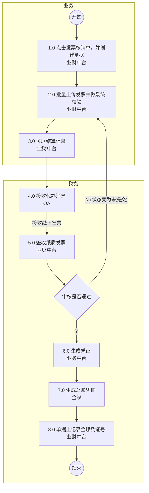
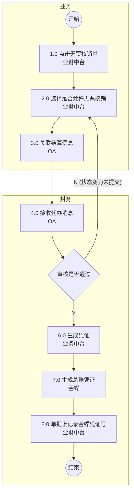

# 发票管理流程图

## 1.发票核销流程

### Mermaid 流程图



### 流程节点说明

| 节点编号 | 节点名称 | 角色/部门 | 节点类型 | 说明 |
|---|---|---|---|---|
| 开始 | 开始 | 业务 | 起点 | 流程开始 |
| 1.0 | 点击发票核销单，并创建单据 | 业务 / 业财中台 | 操作节点 | |
| 2.0 | 批量上传发票并做系统校验 | 业务 / 业财中台 | 操作节点 | |
| 3.0 | 关联结算信息 | 业务 / 业财中台 | 操作节点 | |
| 4.0 | 接收代办消息 | 财务 / OA | 操作节点 | |
| 5.0 | 签收纸质发票 | 财务 / 业财中台 | 操作节点 | |
| 审核是否通过 | 审核是否通过 | 财务 | 判断节点 | |
| 6.0 | 生成凭证 | 财务 / 业务中台 | 操作节点 | |
| 7.0 | 生成总账凭证 | 财务 / 金蝶 | 操作节点 | |
| 8.0 | 单据上记录金蝶凭证号 | 财务 / 业财中台 | 操作节点 | |
| 结束 | 结束 | 财务 | 终点 | 流程结束 |

### 流程分支说明

| 起点 | 条件/操作 | 终点 | 说明 |
|---|---|---|---|
| 4.0 接收代办消息 | 接收线下发票 | 5.0 签收纸质发票 | 线下流转操作 |
| 审核是否通过 | N (状态变为未提交) | 2.0 批量上传发票并做系统校验 | 审核不通过，驳回至业务节点重新处理 |
| 审核是否通过 | Y | 6.0 生成凭证 | 审核通过，继续后续流程 |

### 待确认内容
无

---

## 2.发票红冲流程

### Mermaid 流程图

```mermaid
flowchart TD
    subgraph 业务
        Start((开始)) --> N1[1.0 [待人工确认]点击发票红冲单据<br>业财中台]
        N1 --> N2[2.0 [待人工确认]填写发票红冲单据信息<br>业财中台]
        N2 --> N3[3.0 [待人工确认]提交审批<br>业财中台]
        N3 --> N4[4.0 [待人工确认]业务审批<br>OA]
        N4 --> Cond1{[待人工确认]审批通过}
        Cond1 -- "N (状态变为未提交)" --> N2
        
        N8[8.0 [待人工确认]接收发票<br>线下] --> N9[9.0 [待人工确认]填写发票信息<br>业财中台]
    end
    
    subgraph 财务
        Cond1 -- Y --> N5[5.0 [待人工确认]接收待办消息<br>OA]
        N5 --> N6[6.0 [待人工确认]接收线下退回发票，签收，并退回原发票<br>业财中台]
        N6 --> Cond2{[待人工确认]签收通过}
        Cond2 -- "N (状态变为未提交)" --> N2
        Cond2 -- Y --> N7[7.0 [待人工确认]开启红冲凭证及表单打印<br>业财中台]
        
        N7 -- 纸质发票寄送业务 --> N8
        N9 -- 红冲发票寄件给财务 --> N10[10.0[待人工确认]确认无误<br>业财中台]
        N10 --> N11[11.0 [待人工确认]生成凭证<br>业务中台]
        N11 --> N12[12.0 [待人工确认]生成总账凭证<br>金蝶]
        N12 --> N13[13.0 [待人工确认]记录金蝶凭证号<br>业财中台]
        N13 --> End((结束))
    end
```

### 流程节点说明

| 节点编号 | 节点名称 | 角色/部门 | 节点类型 | 说明 |
|---|---|---|---|---|
| 开始 | 开始 | 业务 | 起点 | 流程开始 |
| 1.0 | [待人工确认]点击发票红冲单据 | 业务 / 业财中台 | 操作节点 | |
| 2.0 | [待人工确认]填写发票红冲单据信息 | 业务 / 业财中台 | 操作节点 | |
| 3.0 | [待人工确认]提交审批 | 业务 / 业财中台 | 操作节点 | |
| 4.0 | [待人工确认]业务审批 | 业务 / OA | 操作节点 | |
| 审批通过 | [待人工确认]审批通过 | 业务 | 判断节点 | |
| 5.0 | [待人工确认]接收待办消息 | 财务 / OA | 操作节点 | |
| 6.0 | [待人工确认]接收线下退回发票，签收，并退回原发票 | 财务 / 业财中台 | 操作节点 | |
| 签收通过 | [待人工确认]签收通过 | 财务 | 判断节点 | |
| 7.0 | [待人工确认]开启红冲凭证及表单打印 | 财务 / 业财中台 | 操作节点 | |
| 8.0 | [待人工确认]接收发票 | 业务 / 线下 | 操作节点 | |
| 9.0 | [待人工确认]填写发票信息 | 业务 / 业财中台 | 操作节点 | |
| 10.0 |[待人工确认]确认无误 | 财务 / 业财中台 | 操作节点 | |
| 11.0 | [待人工确认]生成凭证 | 财务 / 业务中台 | 操作节点 | |
| 12.0 | [待人工确认]生成总账凭证 | 财务 / 金蝶 | 操作节点 | |
| 13.0 | [待人工确认]记录金蝶凭证号 | 财务 / 业财中台 | 操作节点 | |
| 结束 | 结束 | 财务 | 终点 | 流程结束 |

### 流程分支说明

| 起点 | 条件/操作 | 终点 | 说明 |
|---|---|---|---|
| [待人工确认]审批通过 | N (状态变为未提交) | 2.0 [待人工确认]填写发票红冲单据信息 | 审批不通过，驳回至节点2.0 |
| [待人工确认]审批通过 | Y | 5.0 [待人工确认]接收待办消息 | 审批通过，流转至财务 |
| [待人工确认]签收通过 | N (状态变为未提交) | 2.0 [待人工确认]填写发票红冲单据信息 | 签收不通过，驳回至节点2.0 |
|[待人工确认]签收通过 | Y | 7.0 [待人工确认]开启红冲凭证及表单打印 | 签收通过，继续后续流程 |
| 7.0 [待人工确认]开启红冲凭证及表单打印 | 纸质发票寄送业务 | 8.0[待人工确认]接收发票 | 线下流转操作 |
| 9.0 [待人工确认]填写发票信息 | 红冲发票寄件给财务 | 10.0 [待人工确认]确认无误 | 线下流转操作 |

### 待确认内容
由于原图“2.发票红冲流程”分辨率极低且文字模糊，大部分节点名称、判断条件及流转说明均无法清晰辨认。为避免猜测导致业务逻辑错误，已在内容中统一标记“[待人工确认]”，需结合高清原图或业务实际情况进行人工核对与修正。

---

## 3.无票核销流程

### Mermaid 流程图



### 流程节点说明

| 节点编号 | 节点名称 | 角色/部门 | 节点类型 | 说明 |
|---|---|---|---|---|
| 开始 | 开始 | 业务 | 起点 | 流程开始 |
| 1.0 | 点击无票核销单 | 业务 / 业财中台 | 操作节点 | |
| 2.0 | 选择是否允许无票核销 | 业务 / 业财中台 | 操作节点 | |
| 3.0 | 关联结算信息 | 业务 / OA | 操作节点 | |
| 4.0 | 接收代办消息 | 财务 / OA | 操作节点 | |
| 审核是否通过 | 审核是否通过 | 财务 | 判断节点 | |
| 6.0 | 生成凭证 | 财务 / 业务中台 | 操作节点 | |
| 7.0 | 生成总账凭证 | 财务 / 金蝶 | 操作节点 | |
| 8.0 | 单据上记录金蝶凭证号 | 财务 / 业财中台 | 操作节点 | |
| 结束 | 结束 | 财务 | 终点 | 流程结束 |

### 流程分支说明

| 起点 | 条件/操作 | 终点 | 说明 |
|---|---|---|---|
| 审核是否通过 | N (状态变为未提交) | 2.0 选择是否允许无票核销 | 审核不通过，驳回至业务节点重新处理 |
| 审核是否通过 | Y | 6.0 生成凭证 | 审核通过，继续后续流程 |

### 待确认内容
无