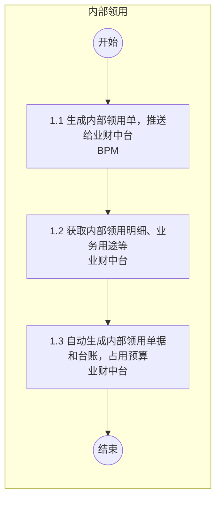

# 内部领用流程图

## 1.内部领用流程

### Mermaid 流程图

### 流程节点说明

| 节点编号 | 节点名称 | 角色/部门 | 节点类型 | 说明 |
|---|---|---|---|---|
| 开始 | 开始 | 内部领用 | 起点 | 流程开始 |
| 1.1 | 生成内部领用单，推送给业财中台 | BPM | 操作节点 | |
| 1.2 | 获取内部领用明细、业务用途等 | 业财中台 | 操作节点 | |
| 1.3 | 自动生成内部领用单据和台账，占用预算 | 业财中台 | 操作节点 | |
| 结束 | 结束 | 内部领用 | 终点 | 流程结束 |

### 流程分支说明

| 起点 | 条件/操作 | 终点 | 说明 |
|---|---|---|---|
| 无 | 无 | 无 | 直线流程，无分支 |

### 待确认内容

无