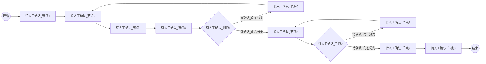
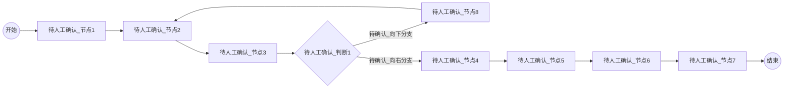
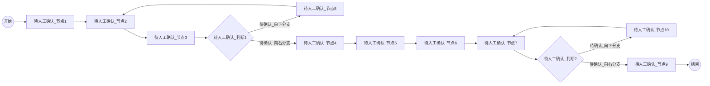
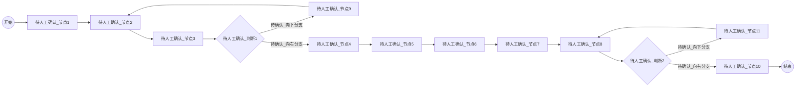
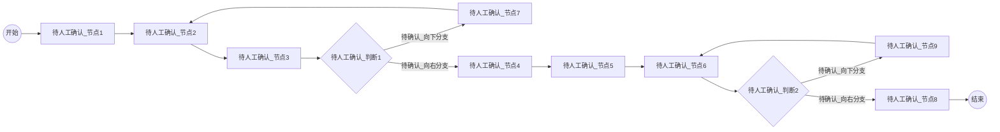
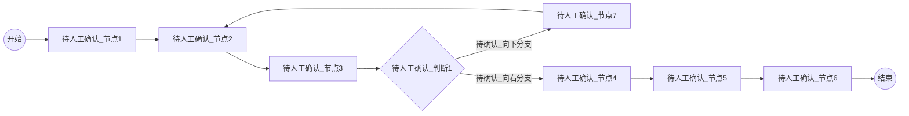

# 1. 投放账户充值申请流程

**业务补充说明**：如果流程走完后业务发现差异，充少了，则业务与财务线下沟通后重新发起新的申请单据补充值差异金额。

## Mermaid 流程图

## 流程节点说明

| 节点编号 | 节点名称 | 角色/部门 | 节点类型 | 说明 |
|---|---|---|---|---|
| Start | 开始 | 待人工确认 | 起点 | 流程开始 |
| N1~N4 | 待人工确认_节点1~4 | 待人工确认 | 操作/审批 | 节点文字模糊，待确认 |
| D1 | 待人工确认_判断1 | 待人工确认 | 判断 | 节点文字模糊，待确认 |
| N5 | 待人工确认_节点5 | 待人工确认 | 操作/审批 | 节点文字模糊，待确认 |
| N6 | 待人工确认_节点6 | 待人工确认 | 操作/处理 | 疑似驳回/退回处理节点 |
| D2 | 待人工确认_判断2 | 待人工确认 | 判断 | 节点文字模糊，待确认 |
| N7~N8 | 待人工确认_节点7~8 | 待人工确认 | 操作/审批 | 节点文字模糊，待确认 |
| N9 | 待人工确认_节点9 | 待人工确认 | 操作/处理 | 疑似驳回/退回处理节点 |
| End | 结束 | 待人工确认 | 终点 | 流程结束 |

## 流程分支说明

| 起点 | 条件/操作 | 终点 | 说明 |
|---|---|---|---|
| D1 | 待人工确认_向右分支 | N5 | 流程继续向下流转 |
| D1 | 待人工确认_向下分支 | N6 | 疑似驳回/退回分支，后续流转回 N2 |
| D2 | 待人工确认_向右分支 | N7 | 流程继续向下流转 |
| D2 | 待人工确认_向下分支 | N9 | 疑似驳回/退回分支，后续流转回 N5 |

## 待确认内容
- 图中所有节点的具体名称、操作角色、判断条件及分支标签均因分辨率过低无法辨认，需人工核对原文件补充。

---

# 2. 投放账户充值退款申请流程

**业务补充说明**：如果平台预充值存在差异，财务充多了，则财务需发起平台预充值退款申请。

## Mermaid 流程图

## 流程节点说明

| 节点编号 | 节点名称 | 角色/部门 | 节点类型 | 说明 |
|---|---|---|---|---|
| Start | 开始 | 待人工确认 | 起点 | 流程开始 |
| N1~N3 | 待人工确认_节点1~3 | 待人工确认 | 操作/审批 | 节点文字模糊，待确认 |
| D1 | 待人工确认_判断1 | 待人工确认 | 判断 | 节点文字模糊，待确认 |
| N4~N7 | 待人工确认_节点4~7 | 待人工确认 | 操作/审批 | 节点文字模糊，待确认 |
| N8 | 待人工确认_节点8 | 待人工确认 | 操作/处理 | 疑似驳回/退回处理节点 |
| End | 结束 | 待人工确认 | 终点 | 流程结束 |

## 流程分支说明

| 起点 | 条件/操作 | 终点 | 说明 |
|---|---|---|---|
| D1 | 待人工确认_向右分支 | N4 | 流程继续向下流转 |
| D1 | 待人工确认_向下分支 | N8 | 疑似驳回/退回分支，后续流转回 N2 |

## 待确认内容
- 图中所有节点的具体名称、操作角色、判断条件及分支标签均因分辨率过低无法辨认，需人工核对原文件补充。

---

# 3. 供应商预付款流程

## Mermaid 流程图

## 流程节点说明

| 节点编号 | 节点名称 | 角色/部门 | 节点类型 | 说明 |
|---|---|---|---|---|
| Start | 开始 | 待人工确认 | 起点 | 流程开始 |
| N1~N3 | 待人工确认_节点1~3 | 待人工确认 | 操作/审批 | 节点文字模糊，待确认 |
| D1 | 待人工确认_判断1 | 待人工确认 | 判断 | 节点文字模糊，待确认 |
| N4~N7 | 待人工确认_节点4~7 | 待人工确认 | 操作/审批 | 节点文字模糊，待确认 |
| N8 | 待人工确认_节点8 | 待人工确认 | 操作/处理 | 疑似驳回/退回处理节点 |
| D2 | 待人工确认_判断2 | 待人工确认 | 判断 | 节点文字模糊，待确认 |
| N9 | 待人工确认_节点9 | 待人工确认 | 操作/审批 | 节点文字模糊，待确认 |
| N10 | 待人工确认_节点10 | 待人工确认 | 操作/处理 | 疑似驳回/退回处理节点 |
| End | 结束 | 待人工确认 | 终点 | 流程结束 |

## 流程分支说明

| 起点 | 条件/操作 | 终点 | 说明 |
|---|---|---|---|
| D1 | 待人工确认_向右分支 | N4 | 流程继续向下流转 |
| D1 | 待人工确认_向下分支 | N8 | 疑似驳回/退回分支，后续流转回 N2 |
| D2 | 待人工确认_向右分支 | N9 | 流程继续向下流转 |
| D2 | 待人工确认_向下分支 | N10 | 疑似驳回/退回分支，后续流转回 N7 |

## 待确认内容
- 图中所有节点的具体名称、操作角色、判断条件及分支标签均因分辨率过低无法辨认，需人工核对原文件补充。

---

# 4. 对公付款申请流程

*注：原文档第2页包含两张标题同为“3.0 对公付款申请流程”的图，结构略有不同，此处分为图1和图2分别提取。*

## 4.1 对公付款申请流程 (图1)

### Mermaid 流程图

### 流程节点与分支说明
- **节点说明**：包含起点、终点、2个判断节点（D1, D2）、2个疑似退回处理节点（N9, N11）及其他常规审批/操作节点。所有节点文字均模糊不清，待人工确认。
- **分支说明**：D1向下分支流转回N2；D2向下分支流转回N8；其余为向右的正向流转分支。
- **待确认内容**：图中所有文本，以及流程图左上方悬浮的蓝色提示框内容均无法辨认。

## 4.2 对公付款申请流程 (图2)

### Mermaid 流程图

### 流程节点与分支说明
- **节点说明**：包含起点、终点、2个判断节点（D1, D2）、2个疑似退回处理节点（N7, N9）及其他常规审批/操作节点。所有节点文字均模糊不清，待人工确认。
- **分支说明**：D1向下分支流转回N2；D2向下分支流转回N6；其余为向右的正向流转分支。
- **待确认内容**：图中所有文本，以及流程图左上方悬浮的蓝色提示框内容均无法辨认。

---

# 5. 退票重付申请流程

## Mermaid 流程图

## 流程节点说明

| 节点编号 | 节点名称 | 角色/部门 | 节点类型 | 说明 |
|---|---|---|---|---|
| Start | 开始 | 待人工确认 | 起点 | 流程开始 |
| N1~N3 | 待人工确认_节点1~3 | 待人工确认 | 操作/审批 | 节点文字模糊，待确认 |
| D1 | 待人工确认_判断1 | 待人工确认 | 判断 | 节点文字模糊，待确认 |
| N4~N6 | 待人工确认_节点4~6 | 待人工确认 | 操作/审批 | 节点文字模糊，待确认 |
| N7 | 待人工确认_节点7 | 待人工确认 | 操作/处理 | 疑似驳回/退回处理节点 |
| End | 结束 | 待人工确认 | 终点 | 流程结束 |

## 流程分支说明

| 起点 | 条件/操作 | 终点 | 说明 |
|---|---|---|---|
| D1 | 待人工确认_向右分支 | N4 | 流程继续向下流转 |
| D1 | 待人工确认_向下分支 | N7 | 疑似驳回/退回分支，后续流转回 N2 |

## 待确认内容
- 图中所有节点的具体名称、操作角色、判断条件及分支标签均因分辨率过低无法辨认，需人工核对原文件补充。