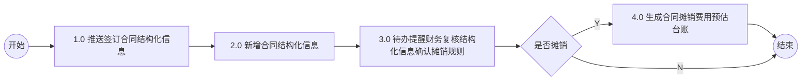
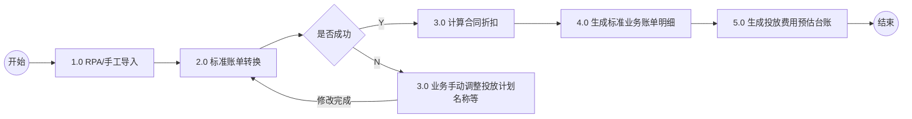
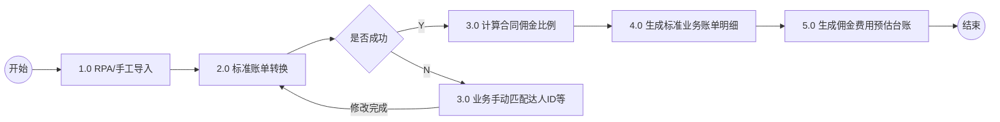
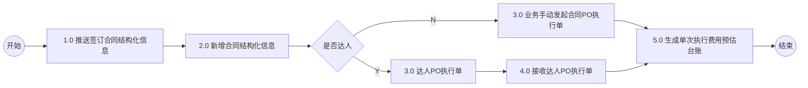
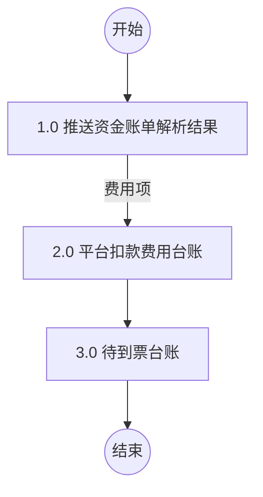

# 1. 合同摊销费用预估流程

## Mermaid 流程图

## 流程节点说明

| 节点编号 | 节点名称 | 角色/部门 | 节点类型 | 说明 |
|---|---|---|---|---|
| Start | 开始 | 合同系统 | 起点 | 流程开始 |
| N1 | 1.0 推送签订合同结构化信息 | 合同系统 | 操作 | 无 |
| N2 | 2.0 新增合同结构化信息 | 业财系统 (业财中台) | 操作 | 无 |
| N3 | 3.0 待办提醒财务复核结构化信息确认摊销规则 | 业财系统 (业财中台) | 操作/审批 | 无 |
| D1 | 是否摊销 | 业财系统 (业财中台) | 判断 | 判断是否需要摊销 |
| N4 | 4.0 生成合同摊销费用预估台账 | 业财系统 (业财中台) | 操作/结果 | 无 |
| End | 结束 | 业财系统 | 终点 | 流程结束 |

## 流程分支说明

| 起点 | 条件/操作 | 终点 | 说明 |
|---|---|---|---|
| D1 | Y | N4 | 确认摊销，生成预估台账 |
| D1 | N | End | 不摊销，直接结束流程 |

## 待确认内容
无

---

# 2. 投放费用预估流程

## Mermaid 流程图

## 流程节点说明

| 节点编号 | 节点名称 | 角色/部门 | 节点类型 | 说明 |
|---|---|---|---|---|
| Start | 开始 | 影刀系统 | 起点 | 流程开始 |
| N1 | 1.0 RPA/手工导入 | 影刀系统 (影刀) | 操作 | 无 |
| N2 | 2.0 标准账单转换 | 业财系统 (中间件) | 操作 | 无 |
| D1 | 是否成功 | 业财系统 | 判断 | 判断账单转换是否成功 |
| N3 | 3.0 计算合同折扣 | 业财系统 (业财中台) | 操作 | 无 |
| N4 | 4.0 生成标准业务账单明细 | 业财系统 (业财中台) | 操作 | 无 |
| N5 | 5.0 生成投放费用预估台账 | 业财系统 (业财中台) | 操作/结果 | 附注：按日+营销活动场景+店铺/品牌/渠道汇总 |
| N6 | 3.0 业务手动调整投放计划名称等 | 业财系统 (业财中台) | 操作/处理 | 附注：消息提醒账户业务对接人；技术：进入影刀页面做数据源处理 |
| End | 结束 | 业财系统 | 终点 | 流程结束 |

## 流程分支说明

| 起点 | 条件/操作 | 终点 | 说明 |
|---|---|---|---|
| D1 | Y | N3 | 转换成功，继续计算折扣 |
| D1 | N | N6 | 转换失败，需业务手动调整 |
| N6 | 修改完成 | N2 | 调整完成后重新进行标准账单转换 |

## 待确认内容
无

---

# 3. 佣金费用预估流程

## Mermaid 流程图

## 流程节点说明

| 节点编号 | 节点名称 | 角色/部门 | 节点类型 | 说明 |
|---|---|---|---|---|
| Start | 开始 | 影刀系统 | 起点 | 流程开始 |
| N1 | 1.0 RPA/手工导入 | 影刀系统 (影刀) | 操作 | 无 |
| N2 | 2.0 标准账单转换 | 业财系统 (中间件) | 操作 | 无 |
| D1 | 是否成功 | 业财系统 | 判断 | 判断账单转换是否成功 |
| N3 | 3.0 计算合同佣金比例 | 业财系统 (业财中台) | 操作 | 无 |
| N4 | 4.0 生成标准业务账单明细 | 业财系统 (业财中台) | 操作 | 无 |
| N5 | 5.0 生成佣金费用预估台账 | 业财系统 (业财中台) | 操作/结果 | 附注：按日+营销活动场景+店铺/品牌/渠道汇总 |
| N6 | 3.0 业务手动匹配达人ID等 | 业财系统 (业财中台) | 操作/处理 | 无 |
| End | 结束 | 业财系统 | 终点 | 流程结束 |

## 流程分支说明

| 起点 | 条件/操作 | 终点 | 说明 |
|---|---|---|---|
| D1 | Y | N3 | 转换成功，继续计算佣金比例 |
| D1 | N | N6 | 转换失败，需业务手动匹配达人ID等 |
| N6 | 修改完成 | N2 | 匹配完成后重新进行标准账单转换 |

## 待确认内容
无

---

# 4. 单次执行费用预估流程

## Mermaid 流程图

## 流程节点说明

| 节点编号 | 节点名称 | 角色/部门 | 节点类型 | 说明 |
|---|---|---|---|---|
| Start | 开始 | 合同系统 | 起点 | 流程开始 |
| N1 | 1.0 推送签订合同结构化信息 | 合同系统 | 操作 | 无 |
| N2 | 2.0 新增合同结构化信息 | 业财系统 (业财中台) | 操作 | 无 |
| D1 | 是否达人 | 业财系统 | 判断 | 判断是否为达人 |
| N3 | 3.0 业务手动发起合同PO执行单 | 业财系统 (业财中台) | 操作 | 无 |
| N5 | 3.0 达人PO执行单 | 业财系统 (达人系统) | 操作 | 附注：任务发布后 |
| N6 | 4.0 接收达人PO执行单 | 业财系统 (业财中台) | 操作 | 无 |
| N4 | 5.0 生成单次执行费用预估台账 | 业财系统 (业财中台) | 操作/结果 | 附注：定时任务计算合同折扣 |
| End | 结束 | 业财系统 | 终点 | 流程结束 |

## 流程分支说明

| 起点 | 条件/操作 | 终点 | 说明 |
|---|---|---|---|
| D1 | N | N3 | 非达人，业务手动发起执行单 |
| D1 | Y | N5 | 是达人，走达人系统PO执行单流程 |
| N3 | 无 | N4 | 流程汇聚，生成预估台账 |
| N6 | 无 | N4 | 流程汇聚，生成预估台账 |

## 待确认内容
无

---

# 5. 平台扣款费用流程

## Mermaid 流程图

## 流程节点说明

| 节点编号 | 节点名称 | 角色/部门 | 节点类型 | 说明 |
|---|---|---|---|---|
| Start | 开始 | OMS系统 | 起点 | 流程开始 |
| N1 | 1.0 推送资金账单解析结果 | OMS系统 (OMS) | 操作 | 无 |
| N2 | 2.0 平台扣款费用台账 | 业财系统 (业财中台) | 操作/结果 | 无 |
| N3 | 3.0 待到票台账 | 业财系统 (业财中台) | 操作/结果 | 无 |
| End | 结束 | 业财系统 | 终点 | 流程结束 |

## 流程分支说明

| 起点 | 条件/操作 | 终点 | 说明 |
|---|---|---|---|
| N1 | 费用项 | N2 | 解析结果为费用项时，生成平台扣款费用台账 |

## 待确认内容
无