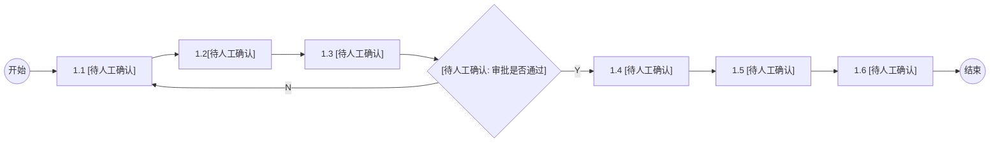
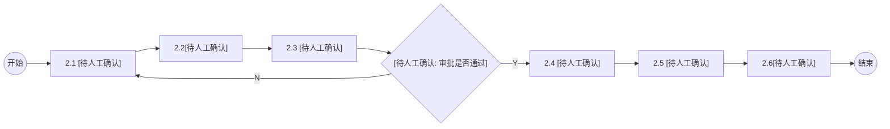
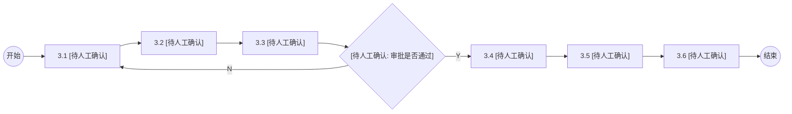
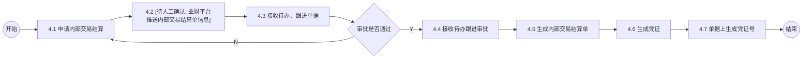
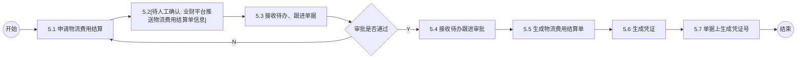

# 1. 其他损益确认

## Mermaid 流程图

## 流程节点说明

| 节点编号 | 节点名称 | 角色/部门 | 节点类型 | 说明 |
|---|---|---|---|---|
| - | 开始 | - | 开始节点 | 流程开始 |
| 1.1 | [待人工确认] | 业财平台(推测) | 操作节点 | 图片模糊，文字无法辨认 |
| 1.2 |[待人工确认] | 业财平台(推测) | 操作节点 | 图片模糊，文字无法辨认 |
| 1.3 | [待人工确认] | 业财平台(推测) | 操作节点 | 图片模糊，文字无法辨认 |
| - | [待人工确认: 审批是否通过] | - | 判断节点 | 图片模糊，根据流程结构推测为审批判断 |
| 1.4 | [待人工确认] | OA(推测) | 操作节点 | 图片模糊，文字无法辨认 |
| 1.5 | [待人工确认] | 金蝶(推测) | 操作节点 | 图片模糊，文字无法辨认 |
| 1.6 | [待人工确认] | 业财平台(推测) | 操作节点 | 图片模糊，文字无法辨认 |
| - | 结束 | - | 结束节点 | 流程结束 |

## 流程分支说明

| 起点 | 条件/操作 | 终点 | 说明 |
|---|---|---|---|
| [待人工确认: 审批是否通过] | Y | 1.4 [待人工确认] | 审批通过，进入下一环节 |
|[待人工确认: 审批是否通过] | N | 1.1 [待人工确认] | 审批驳回，返回初始节点 |

## 待确认内容

1. 该流程图整体分辨率过低，所有节点内的具体文本以及判断条件均无法清晰辨认，已全部标记为 `[待人工确认]`。
2. 节点对应的角色/部门（业财平台、OA、金蝶）是基于后续清晰流程图的样式和字数特征推测得出，需人工最终核对确认。

---

# 2. 会员积分预提单

## Mermaid 流程图

## 流程节点说明

| 节点编号 | 节点名称 | 角色/部门 | 节点类型 | 说明 |
|---|---|---|---|---|
| - | 开始 | - | 开始节点 | 流程开始 |
| 2.1 |[待人工确认] | 业财平台(推测) | 操作节点 | 图片模糊，文字无法辨认 |
| 2.2 | [待人工确认] | 业财平台(推测) | 操作节点 | 图片模糊，文字无法辨认 |
| 2.3 | [待人工确认] | 业财平台(推测) | 操作节点 | 图片模糊，文字无法辨认 |
| - |[待人工确认: 审批是否通过] | - | 判断节点 | 图片模糊，根据流程结构推测为审批判断 |
| 2.4 | [待人工确认] | OA(推测) | 操作节点 | 图片模糊，文字无法辨认 |
| 2.5 | [待人工确认] | 金蝶(推测) | 操作节点 | 图片模糊，文字无法辨认 |
| 2.6 |[待人工确认] | 业财平台(推测) | 操作节点 | 图片模糊，文字无法辨认 |
| - | 结束 | - | 结束节点 | 流程结束 |

## 流程分支说明

| 起点 | 条件/操作 | 终点 | 说明 |
|---|---|---|---|
|[待人工确认: 审批是否通过] | Y | 2.4 [待人工确认] | 审批通过，进入下一环节 |
| [待人工确认: 审批是否通过] | N | 2.1[待人工确认] | 审批驳回，返回初始节点 |

## 待确认内容

1. 该流程图整体分辨率过低，所有节点内的具体文本以及判断条件均无法清晰辨认，已全部标记为 `[待人工确认]`。
2. 节点对应的角色/部门推测逻辑同上，需人工核对确认。

---

# 3. 预计退货预提单

## Mermaid 流程图

## 流程节点说明

| 节点编号 | 节点名称 | 角色/部门 | 节点类型 | 说明 |
|---|---|---|---|---|
| - | 开始 | - | 开始节点 | 流程开始 |
| 3.1 | [待人工确认] | 业财平台(推测) | 操作节点 | 图片模糊，文字无法辨认 |
| 3.2 |[待人工确认] | 业财平台(推测) | 操作节点 | 图片模糊，文字无法辨认 |
| 3.3 | [待人工确认] | 业财平台(推测) | 操作节点 | 图片模糊，文字无法辨认 |
| - | [待人工确认: 审批是否通过] | - | 判断节点 | 图片模糊，根据流程结构推测为审批判断 |
| 3.4 |[待人工确认] | OA(推测) | 操作节点 | 图片模糊，文字无法辨认 |
| 3.5 | [待人工确认] | 金蝶(推测) | 操作节点 | 图片模糊，文字无法辨认 |
| 3.6 | [待人工确认] | 业财平台(推测) | 操作节点 | 图片模糊，文字无法辨认 |
| - | 结束 | - | 结束节点 | 流程结束 |

## 流程分支说明

| 起点 | 条件/操作 | 终点 | 说明 |
|---|---|---|---|
| [待人工确认: 审批是否通过] | Y | 3.4 [待人工确认] | 审批通过，进入下一环节 |
|[待人工确认: 审批是否通过] | N | 3.1 [待人工确认] | 审批驳回，返回初始节点 |

## 待确认内容

1. 该流程图整体分辨率过低，所有节点内的具体文本以及判断条件均无法清晰辨认，已全部标记为 `[待人工确认]`。
2. 节点对应的角色/部门推测逻辑同上，需人工核对确认。

---

# 4. 内部交易结算单

## Mermaid 流程图

## 流程节点说明

| 节点编号 | 节点名称 | 角色/部门 | 节点类型 | 说明 |
|---|---|---|---|---|
| - | 开始 | - | 开始节点 | 流程开始 |
| 4.1 | 申请内部交易结算 | 业财平台 | 操作节点 | - |
| 4.2 |[待人工确认: 业财平台推送内部交易结算单信息] | 业财平台 | 操作节点 | 图片较模糊，基于上下文推测 |
| 4.3 | 接收待办、跟进单据 | 业财平台 | 操作节点 | - |
| - | 审批是否通过 | - | 判断节点 | - |
| 4.4 | 接收待办跟进审批 | OA | 操作节点 | - |
| 4.5 | 生成内部交易结算单 | 业财平台 | 操作节点 | - |
| 4.6 | 生成凭证 | 金蝶 | 操作节点 | - |
| 4.7 | 单据上生成凭证号 | 业财平台 | 操作节点 | - |
| - | 结束 | - | 结束节点 | 流程结束 |

## 流程分支说明

| 起点 | 条件/操作 | 终点 | 说明 |
|---|---|---|---|
| 审批是否通过 | Y | 4.4 接收待办跟进审批 | 审批通过，进入 OA 审批环节 |
| 审批是否通过 | N | 4.1 申请内部交易结算 | 审批驳回，返回重新申请 |

## 待确认内容

1. 节点 4.2 的具体文本由于字号较小且模糊，初步识别为“业财平台推送内部交易结算单信息”，需人工最终核对确认。

---

# 5. 物流费用结算单

## Mermaid 流程图

## 流程节点说明

| 节点编号 | 节点名称 | 角色/部门 | 节点类型 | 说明 |
|---|---|---|---|---|
| - | 开始 | - | 开始节点 | 流程开始 |
| 5.1 | 申请物流费用结算 | 业财平台 | 操作节点 | - |
| 5.2 |[待人工确认: 业财平台推送物流费用结算单信息] | 业财平台 | 操作节点 | 图片较模糊，基于上下文推测 |
| 5.3 | 接收待办、跟进单据 | 业财平台 | 操作节点 | - |
| - | 审批是否通过 | - | 判断节点 | - |
| 5.4 | 接收待办跟进审批 | OA | 操作节点 | - |
| 5.5 | 生成物流费用结算单 | 业财平台 | 操作节点 | - |
| 5.6 | 生成凭证 | 金蝶 | 操作节点 | - |
| 5.7 | 单据上生成凭证号 | 业财平台 | 操作节点 | - |
| - | 结束 | - | 结束节点 | 流程结束 |

## 流程分支说明

| 起点 | 条件/操作 | 终点 | 说明 |
|---|---|---|---|
| 审批是否通过 | Y | 5.4 接收待办跟进审批 | 审批通过，进入 OA 审批环节 |
| 审批是否通过 | N | 5.1 申请物流费用结算 | 审批驳回，返回重新申请 |

## 待确认内容

1. 节点 5.2 的具体文本由于字号较小且模糊，初步识别为“业财平台推送物流费用结算单信息”，需人工最终核对确认。