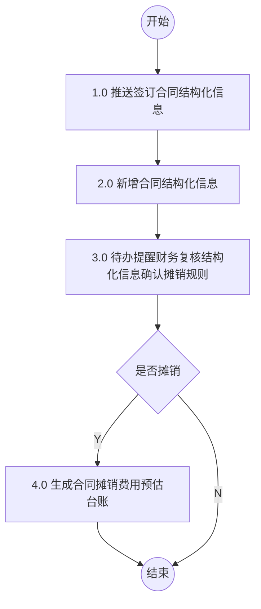
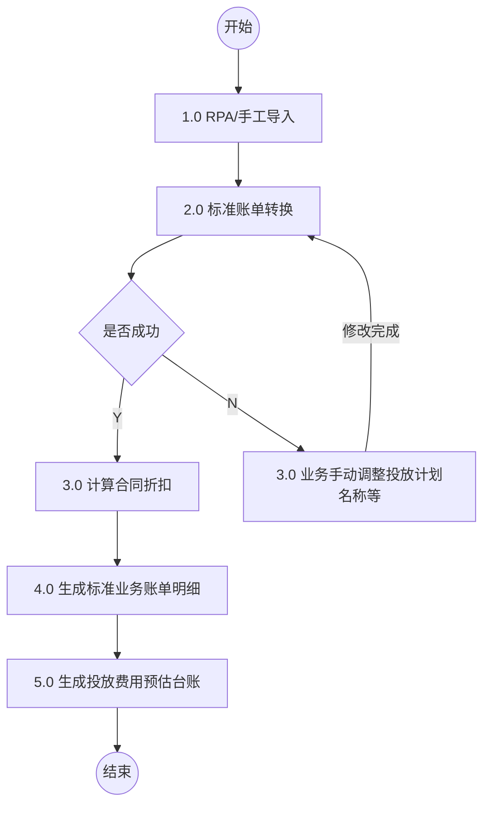

# 1.自动对账结算流程 (1.0 合同摊销费用预估流程)

## Mermaid 流程图

## 流程节点说明

| 节点编号 | 节点名称 | 角色/部门 | 节点类型 | 说明 |
|---|---|---|---|---|
| - | 开始 | - | 开始节点 | 流程开始 |
| 1.0 | 1.0 推送签订合同结构化信息 | 合同系统 | 操作节点 | - |
| 2.0 | 2.0 新增合同结构化信息 | 业财系统(业财中台) | 操作节点 | - |
| 3.0 | 3.0 待办提醒财务复核结构化信息确认摊销规则 | 业财系统(业财中台) | 操作节点 | - |
| - | 是否摊销 | 业财系统 | 判断节点 | - |
| 4.0 | 4.0 生成合同摊销费用预估台账 | 业财系统(业财中台) | 操作节点 | - |
| - | 结束 | - | 结束节点 | 流程结束 |

## 流程分支说明

| 起点 | 条件/操作 | 终点 | 说明 |
|---|---|---|---|
| 是否摊销 | Y | 4.0 生成合同摊销费用预估台账 | 确认需要摊销，生成预估台账 |
| 是否摊销 | N | 结束 | 不摊销，直接结束流程 |

## 待确认内容

无

---

# 2.手动对账结算流程 (2.0 投放费用预估流程)

## Mermaid 流程图

## 流程节点说明

| 节点编号 | 节点名称 | 角色/部门 | 节点类型 | 说明 |
|---|---|---|---|---|
| - | 开始 | - | 开始节点 | 流程开始 |
| 1.0 | 1.0 RPA/手工导入 | 影刀系统(影刀) | 操作节点 | - |
| 2.0 | 2.0 标准账单转换 | 业财系统(中间件) | 操作节点 | - |
| - | 是否成功 | 业财系统 | 判断节点 | - |
| 3.0 | 3.0 计算合同折扣 | 业财系统(业财中台) | 操作节点 | - |
| 4.0 | 4.0 生成标准业务账单明细 | 业财系统(业财中台) | 操作节点 | - |
| 5.0 | 5.0 生成投放费用预估台账 | 业财系统(业财中台) | 操作节点 | 节点下方附注：按日+营销活动场景+店铺/品牌/渠道汇总 |
| 3.0 | 3.0 业务手动调整投放计划名称等 | 业财系统(业财中台) | 操作节点 | 节点旁附注：消息提醒账户业务对接人；节点下方附注：技术：进入影刀页面做数据源处理 |
| - | 结束 | - | 结束节点 | 流程结束 |

## 流程分支说明

| 起点 | 条件/操作 | 终点 | 说明 |
|---|---|---|---|
| 是否成功 | Y | 3.0 计算合同折扣 | 账单转换成功，进入下一步计算 |
| 是否成功 | N | 3.0 业务手动调整投放计划名称等 | 账单转换失败，需业务手动调整 |
| 3.0 业务手动调整投放计划名称等 | 修改完成 | 2.0 标准账单转换 | 手动调整完成后，重新进行标准账单转换 |

## 待确认内容

无