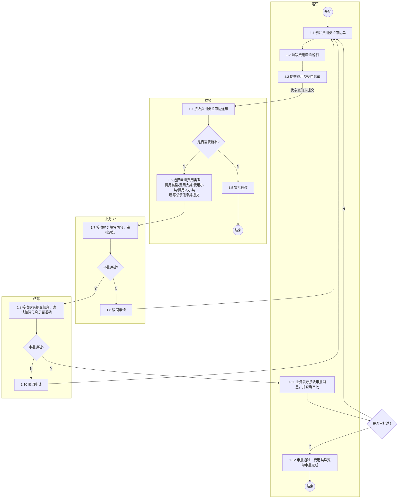
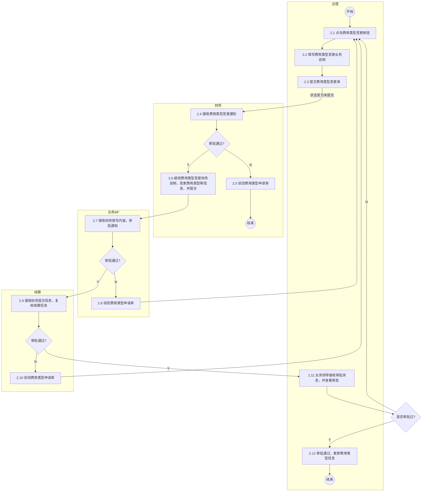
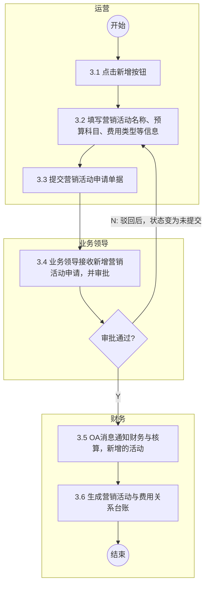
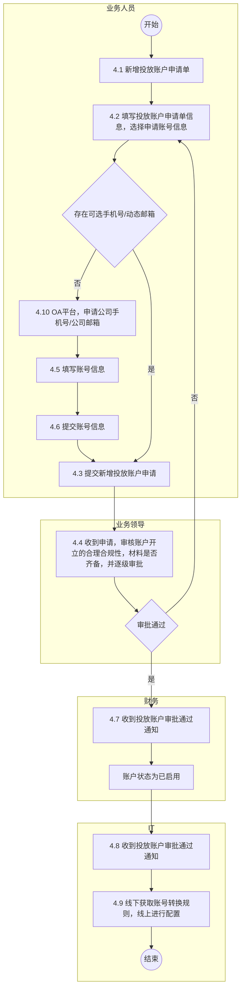
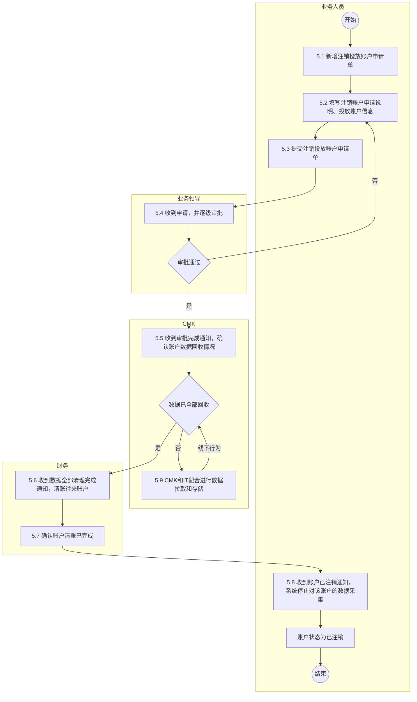
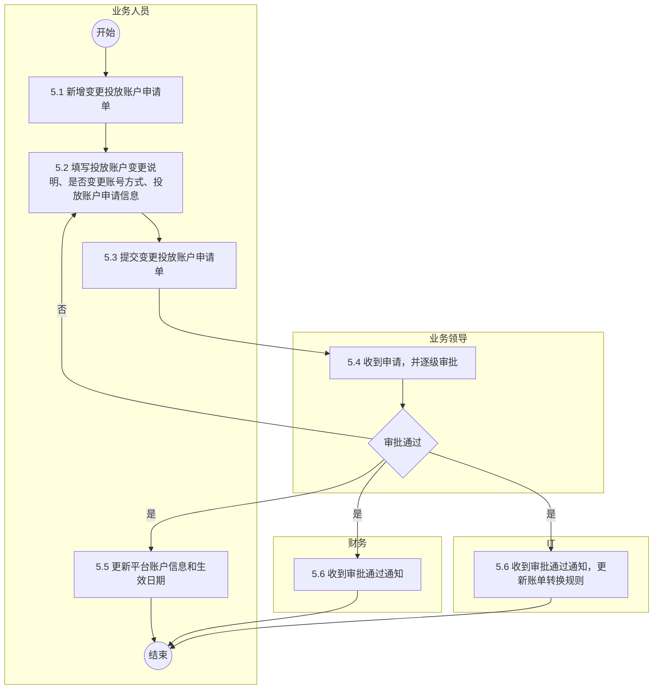
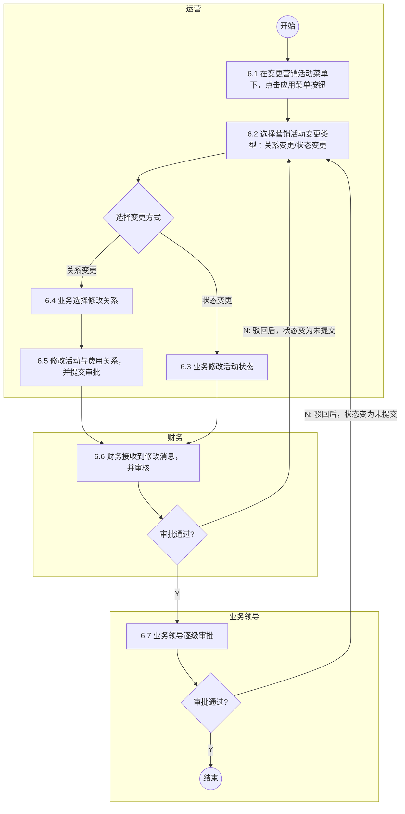
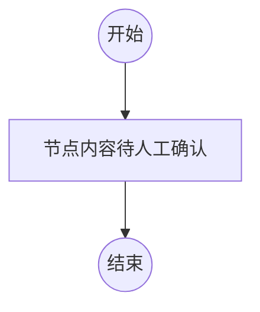

# 1.申请营销费用类型

## Mermaid 流程图

## 流程节点说明

| 节点编号 | 节点名称 | 角色/部门 | 节点类型 | 说明 |
|---|---|---|---|---|
| - | 开始 | 运营 | 开始节点 | 流程触发 |
| 1.1 | 创建费用类型申请单 | 运营 | 操作节点 | 业财中台操作 |
| 1.2 | 填写费用申请说明 | 运营 | 操作节点 | 业财中台操作 |
| 1.3 | 提交费用类型申请单 | 运营 | 操作节点 | 业财中台操作 |
| 1.4 | 接收费用类型申请通知 | 财务 | 操作节点 | 业财中台操作 |
| - | 是否需要新增? | 财务 | 判断节点 | 判断是否需要新增费用类型 |
| 1.5 | 审批通过 | 财务 | 操作节点 | 业财中台操作，不需要新增时直接通过 |
| 1.6 | 选择申请费用类型（费用类型/费用大类/费用小类/费用大小类），填写必填信息并提交 | 财务 | 操作节点 | 业财中台操作，补充具体费用类型信息 |
| 1.7 | 接收财务填写内容，审批通知 | 业务BP | 操作节点 | 业财中台操作 |
| - | 审批通过? | 业务BP | 判断节点 | 判断业务BP是否审批通过 |
| 1.8 | 驳回申请 | 业务BP | 操作节点 | 业财中台操作 |
| 1.9 | 接收财务提交信息，确认核算信息是否准确 | 结算 | 操作节点 | 业财中台操作 |
| - | 审批通过? | 结算 | 判断节点 | 判断结算是否审批通过 |
| 1.10 | 驳回申请 | 结算 | 操作节点 | 业财中台操作 |
| 1.11 | 业务领导接收审批消息，并查看审批 | 运营 | 操作节点 | 业财中台操作 |
| - | 是否审批过? | 运营 | 判断节点 | 判断业务领导是否审批通过 |
| 1.12 | 审批通过，费用类型变为审批完成 | 运营 | 结束节点 | 业财中台操作，流程结束 |

## 流程分支说明

| 起点 | 条件/操作 | 终点 | 说明 |
|---|---|---|---|
| 1.3 提交费用类型申请单 | 状态变为未提交 | 1.4 接收费用类型申请通知 | 提交后流转至财务 |
| 是否需要新增? (财务) | N | 1.5 审批通过 | 不需要新增，财务审批通过，流程结束 |
| 是否需要新增? (财务) | Y | 1.6 选择申请费用类型... | 需要新增，财务补充信息并提交 |
| 审批通过? (业务BP) | N | 1.8 驳回申请 | 业务BP审批不通过，驳回至起点 |
| 审批通过? (业务BP) | Y | 1.9 接收财务提交信息... | 业务BP审批通过，流转至结算 |
| 审批通过? (结算) | N | 1.10 驳回申请 | 结算审批不通过，驳回至起点 |
| 审批通过? (结算) | Y | 1.11 业务领导接收审批消息... | 结算审批通过，流转至运营确认 |
| 是否审批过? (运营) | N | 1.1 创建费用类型申请单 | 领导未审批通过，驳回 |
| 是否审批过? (运营) | Y | 1.12 审批通过... | 领导审批通过，流程结束 |

## 待确认内容

无（已通过人工校验修正）。

---

# 2.变更费用类型流程

## Mermaid 流程图

## 流程节点说明

| 节点编号 | 节点名称 | 角色/部门 | 节点类型 | 说明 |
|---|---|---|---|---|
| - | 开始 | 运营 | 开始节点 | 流程触发 |
| 2.1 | 点击费用类型变更按钮 | 运营 | 操作节点 | 业财中台操作 |
| 2.2 | 填写费用类型变更业务说明 | 运营 | 操作节点 | 业财中台操作 |
| 2.3 | 提交费用类型变更单 | 运营 | 操作节点 | 业财中台操作 |
| 2.4 | 接收费用类型变更通知 | 财务 | 操作节点 | OA操作 |
| - | 审批通过? | 财务 | 判断节点 | 判断财务是否审批通过 |
| 2.5 | 驳回费用类型申请单 | 财务 | 操作节点 | OA操作 |
| 2.6 | 接收费用类型变更财务说明...并提交 | 财务 | 操作节点 | 业财中台操作 |
| 2.7 | 接收财务填写内容，审批通知 | 业务BP | 操作节点 | 业财中台操作 |
| - | 审批通过? | 业务BP | 判断节点 | 判断业务BP是否审批通过 |
| 2.8 | 驳回费用类型申请单 | 业务BP | 操作节点 | 业财中台操作 |
| 2.9 | 接收财务提交信息，复核核算信息 | 结算 | 操作节点 | 业财中台操作 |
| - | 审批通过? | 结算 | 判断节点 | 判断结算是否审批通过 |
| 2.10 | 驳回费用类型申请单 | 结算 | 操作节点 | 业财中台操作 |
| 2.11 | 业务领导接收审批消息，并查看审批 | 运营 | 操作节点 | 业财中台操作 |
| - | 是否审批过? | 运营 | 判断节点 | 判断业务领导是否审批通过 |
| 2.12 | 审批通过，更新费用类型信息 | 运营 | 结束节点 | 业财中台操作，流程结束 |

## 流程分支说明

| 起点 | 条件/操作 | 终点 | 说明 |
|---|---|---|---|
| 2.3 提交费用类型变更单 | 状态变为未提交 | 2.4 接收费用类型变更通知 | 提交后流转至财务 |
| 审批通过? (财务) | N | 2.5 驳回费用类型申请单 | 财务审批不通过，流程结束 |
| 审批通过? (财务) | Y | 2.6 接收费用类型变更财务说明... | 财务审批通过，继续补充信息 |
| 审批通过? (业务BP) | N | 2.8 驳回费用类型申请单 | 业务BP审批不通过，驳回至起点 |
| 审批通过? (业务BP) | Y | 2.9 接收财务提交信息... | 业务BP审批通过，流转至结算 |
| 审批通过? (结算) | N | 2.10 驳回费用类型申请单 | 结算审批不通过，驳回至起点 |
| 审批通过? (结算) | Y | 2.11 业务领导接收审批消息... | 结算审批通过，流转至运营确认 |
| 是否审批过? (运营) | N | 2.1 点击费用类型变更按钮 | 领导未审批通过，驳回 |
| 是否审批过? (运营) | Y | 2.12 审批通过... | 领导审批通过，流程结束 |

## 待确认内容

无

---

# 3.申请营销活动流程

## Mermaid 流程图

## 流程节点说明

| 节点编号 | 节点名称 | 角色/部门 | 节点类型 | 说明 |
|---|---|---|---|---|
| - | 开始 | 运营 | 开始节点 | 流程触发 |
| 3.1 | 点击新增按钮 | 运营 | 操作节点 | 业财中台操作 |
| 3.2 | 填写营销活动名称、预算科目、费用类型等信息 | 运营 | 操作节点 | 业财中台操作 |
| 3.3 | 提交营销活动申请单据 | 运营 | 操作节点 | 业财中台操作 |
| 3.4 | 业务领导接收新增营销活动申请，并审批 | 业务领导 | 操作节点 | 业财中台操作 |
| - | 审批通过? | 业务领导 | 判断节点 | 判断业务领导是否审批通过 |
| 3.5 | OA消息通知财务与核算，新增的活动 | 财务 | 操作节点 | OA操作 |
| 3.6 | 生成营销活动与费用关系台账 | 财务 | 结束节点 | 业财中台操作，流程结束 |

## 流程分支说明

| 起点 | 条件/操作 | 终点 | 说明 |
|---|---|---|---|
| 审批通过? | N | 3.2 填写营销活动名称... | 审批不通过，驳回后状态变为未提交 |
| 审批通过? | Y | 3.5 OA消息通知财务与核算... | 审批通过，流转至财务 |

## 待确认内容

无

---

# 4.新增投放账户流程

## Mermaid 流程图

## 流程节点说明

| 节点编号 | 节点名称 | 角色/部门 | 节点类型 | 说明 |
|---|---|---|---|---|
| - | 开始 | 业务人员 | 开始节点 | 流程触发 |
| 4.1 | 新增投放账户申请单 | 业务人员 | 操作节点 | 业财中台操作 |
| 4.2 | 填写投放账户申请单信息，选择申请账号信息 | 业务人员 | 操作节点 | 业财中台操作 |
| - | 存在可选手机号/动态邮箱 | 业务人员 | 判断节点 | 判断前置条件 |
| 4.10 | OA平台，申请公司手机号/公司邮箱 | 业务人员 | 操作节点 | OA平台操作 |
| 4.5 | 填写账号信息 | 业务人员 | 操作节点 | 业财中台操作 |
| 4.6 | 提交账号信息 | 业务人员 | 操作节点 | 业财中台操作 |
| 4.3 | 提交新增投放账户申请 | 业务人员 | 操作节点 | 业财中台操作 |
| 4.4 | 收到申请，审核账户开立的合理合规性... | 业务领导 | 操作节点 | OA操作 |
| - | 审批通过 | 业务领导 | 判断节点 | 判断业务领导是否审批通过 |
| 4.7 | 收到投放账户审批通过通知 | 财务 | 操作节点 | OA操作 |
| - | 账户状态为已启用 | 财务 | 状态说明 | 业务状态变更 |
| 4.8 | 收到投放账户审批通过通知 | IT | 操作节点 | OA操作 |
| 4.9 | 线下获取账号转换规则，线上进行配置 | IT | 结束节点 | 业财中台操作，流程结束 |

## 流程分支说明

| 起点 | 条件/操作 | 终点 | 说明 |
|---|---|---|---|
| 存在可选手机号/动态邮箱 | 否 | 4.10 OA平台，申请... | 不存在时需先申请账号 |
| 存在可选手机号/动态邮箱 | 是 | 4.3 提交新增投放账户申请 | 存在时直接提交申请 |
| 审批通过 | 否 | 4.2 填写投放账户申请单信息... | 审批不通过，驳回修改 |
| 审批通过 | 是 | 4.7 收到投放账户审批通过通知 | 审批通过，流转至财务 |

## 待确认内容

无

---

# 5.注销投放账户流程

## Mermaid 流程图

## 流程节点说明

| 节点编号 | 节点名称 | 角色/部门 | 节点类型 | 说明 |
|---|---|---|---|---|
| - | 开始 | 业务人员 | 开始节点 | 流程触发 |
| 5.1 | 新增注销投放账户申请单 | 业务人员 | 操作节点 | 业财中台操作 |
| 5.2 | 填写注销账户申请说明、投放账户信息 | 业务人员 | 操作节点 | 业财中台操作 (附带账户材料) |
| 5.3 | 提交注销投放账户申请单 | 业务人员 | 操作节点 | 业财中台操作 |
| 5.4 | 收到申请，并逐级审批 | 业务领导 | 操作节点 | OA操作 |
| - | 审批通过 | 业务领导 | 判断节点 | 判断是否审批通过 |
| 5.5 | 收到审批完成通知，确认账户数据回收情况 | CMK | 操作节点 | OA操作 |
| - | 数据已全部回收 | CMK | 判断节点 | 判断数据回收状态 |
| 5.9 | CMK和IT配合进行数据拉取和存储 | CMK | 操作节点 | 线下行为 |
| 5.6 | 收到数据全部清理完成通知，清账往来账户 | 财务 | 操作节点 | OA操作 |
| 5.7 | 确认账户清账已完成 | 财务 | 操作节点 | OA操作 |
| 5.8 | 收到账户已注销通知，系统停止对该账户的数据采集 | 业务人员 | 操作节点 | 业财中台操作 |
| - | 账户状态为已注销 | 业务人员 | 状态说明 | 业务状态变更 |

## 流程分支说明

| 起点 | 条件/操作 | 终点 | 说明 |
|---|---|---|---|
| 审批通过 | 否 | 5.2 填写注销账户申请说明... | 审批不通过，驳回修改 |
| 审批通过 | 是 | 5.5 收到审批完成通知... | 审批通过，流转至CMK |
| 数据已全部回收 | 否 | 5.9 CMK和IT配合进行数据拉取和存储 | 数据未回收完毕，需线下处理 |
| 数据已全部回收 | 是 | 5.6 收到数据全部清理完成通知... | 数据回收完毕，流转至财务清账 |

## 待确认内容

无

---

# 6. 变更投放账户流程

## Mermaid 流程图

## 流程节点说明

| 节点编号 | 节点名称 | 角色/部门 | 节点类型 | 说明 |
|---|---|---|---|---|
| - | 开始 | 业务人员 | 开始节点 | 流程触发 |
| 5.1 | 新增变更投放账户申请单 | 业务人员 | 操作节点 | 业财中台操作（已修正原图 6.1 笔误） |
| 5.2 | 填写投放账户变更说明、是否变更账号方式... | 业务人员 | 操作节点 | 业财中台操作 |
| 5.3 | 提交变更投放账户申请单 | 业务人员 | 操作节点 | 业财中台操作 |
| 5.4 | 收到申请，并逐级审批 | 业务领导 | 操作节点 | OA操作 |
| - | 审批通过 | 业务领导 | 判断节点 | 判断是否审批通过 |
| 5.5 | 更新平台账户信息和生效日期 | 业务人员 | 操作节点 | OA操作 |
| 5.6 | 收到审批通过通知 | 财务 | 操作节点 | OA操作 |
| 5.6 | 收到审批通过通知，更新账单转换规则 | IT | 操作节点 | OA操作 |

## 流程分支说明

| 起点 | 条件/操作 | 终点 | 说明 |
|---|---|---|---|
| 审批通过 | 否 | 5.2 填写投放账户变更说明... | 审批不通过，驳回修改 |
| 审批通过 | 是 | 5.5 更新平台账户信息和生效日期 | 审批通过，业务人员更新信息 |
| 审批通过 | 是 | 5.6 收到审批通过通知 (财务) | 审批通过，并行通知财务 |
| 审批通过 | 是 | 5.6 收到审批通过通知... (IT) | 审批通过，并行通知IT更新规则 |

## 待确认内容

无（原图编号笔误已通过人工校验修正）。

---

# 7.更新营销活动与费用类型关系流程

## Mermaid 流程图

## 流程节点说明

| 节点编号 | 节点名称 | 角色/部门 | 节点类型 | 说明 |
|---|---|---|---|---|
| - | 开始 | 运营 | 开始节点 | 流程触发 |
| 6.1 | 在变更营销活动菜单下，点击应用菜单按钮 | 运营 | 操作节点 | 业财中台操作 |
| 6.2 | 选择营销活动变更类型：关系变更/状态变更 | 运营 | 操作节点 | 业财中台操作 |
| - | 选择变更方式 | 运营 | 判断节点 | 判断变更类型 |
| 6.4 | 业务选择修改关系 | 运营 | 操作节点 | 业财系统操作 |
| 6.5 | 修改活动与费用关系，并提交审批 | 运营 | 操作节点 | 业财系统操作 |
| 6.3 | 业务修改活动状态 | 运营 | 操作节点 | 业财系统操作 |
| 6.6 | 财务接收到修改消息，并审核 | 财务 | 操作节点 | OA操作 |
| - | 审批通过? | 财务 | 判断节点 | 判断财务是否审批通过 |
| 6.7 | 业务领导逐级审批 | 业务领导 | 操作节点 | 业财中台操作 |
| - | 审批通过? | 业务领导 | 判断节点 | 判断业务领导是否审批通过 |

## 流程分支说明

| 起点 | 条件/操作 | 终点 | 说明 |
|---|---|---|---|
| 选择变更方式 | 关系变更 | 6.4 业务选择修改关系 | 选择关系变更的分支 |
| 选择变更方式 | 状态变更 | 6.3 业务修改活动状态 | 选择状态变更的分支 |
| 审批通过? (财务) | N | 6.2 选择营销活动变更类型... | 财务审批不通过，驳回后状态变为未提交 |
| 审批通过? (财务) | Y | 6.7 业务领导逐级审批 | 财务审批通过，流转至业务领导 |
| 审批通过? (业务领导) | N | 6.2 选择营销活动变更类型... | 业务领导审批不通过，驳回后状态变为未提交 |
| 审批通过? (业务领导) | Y | 结束 | 业务领导审批通过，流程结束 |

## 待确认内容

无

---

# 8.三方账户开立流程

## Mermaid 流程图

## 流程节点说明

| 节点编号 | 节点名称 | 角色/部门 | 节点类型 | 说明 |
|---|---|---|---|---|
| - | 待人工确认 | 待人工确认 | 待人工确认 | 图片模糊，节点内容待人工确认 |

## 流程分支说明

| 起点 | 条件/操作 | 终点 | 说明 |
|---|---|---|---|
| 待人工确认 | 待人工确认 | 待人工确认 | 图片模糊，分支内容待人工确认 |

## 待确认内容

- 整个流程图图片极度模糊，无法识别任何文字，所有节点、角色、分支均待人工确认。

---

# 9.三方账户变更流程

## Mermaid 流程图

## 流程节点说明

| 节点编号 | 节点名称 | 角色/部门 | 节点类型 | 说明 |
|---|---|---|---|---|
| - | 待人工确认 | 待人工确认 | 待人工确认 | 图片模糊，节点内容待人工确认 |

## 流程分支说明

| 起点 | 条件/操作 | 终点 | 说明 |
|---|---|---|---|
| 待人工确认 | 待人工确认 | 待人工确认 | 图片模糊，分支内容待人工确认 |

## 待确认内容

- 整个流程图图片极度模糊，无法识别任何文字，所有节点、角色、分支均待人工确认。

---

# 10.三方账户关闭流程

## Mermaid 流程图

## 流程节点说明

| 节点编号 | 节点名称 | 角色/部门 | 节点类型 | 说明 |
|---|---|---|---|---|
| - | 待人工确认 | 待人工确认 | 待人工确认 | 图片模糊，节点内容待人工确认 |

## 流程分支说明

| 起点 | 条件/操作 | 终点 | 说明 |
|---|---|---|---|
| 待人工确认 | 待人工确认 | 待人工确认 | 图片模糊，分支内容待人工确认 |

## 待确认内容

- 整个流程图图片极度模糊，无法识别任何文字，所有节点、角色、分支均待人工确认。

