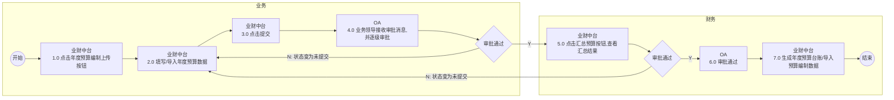
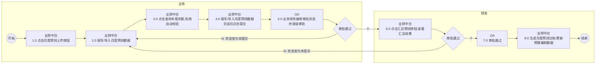
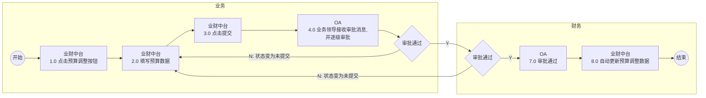

# 1.年度预算编制上传流程

## Mermaid 流程图

## 流程节点说明

| 节点编号 | 节点名称 | 角色/部门 | 节点类型 | 说明 |
|---|---|---|---|---|
| - | 开始 | 业务 | 开始节点 | 流程触发起点 |
| 1.0 | 点击年度预算编制上传按钮 | 业务 (业财中台) | 操作 | 业务人员在业财中台发起年度预算编制上传 |
| 2.0 | 填写/导入年度预算数据 | 业务 (业财中台) | 操作 | 填写或导入相关的预算数据 |
| 3.0 | 点击提交 | 业务 (业财中台) | 操作 | 提交已填写的预算数据 |
| 4.0 | 业务领导接收审批消息，并逐级审批 | 业务 (OA) | 审批 | 业务线领导在OA系统中进行逐级审批 |
| - | 审批通过 (业务) | 业务 | 判断 | 判断业务领导审批是否通过 |
| 5.0 | 点击汇总预算按钮，查看汇总结果 | 财务 (业财中台) | 操作 | 财务人员在业财中台汇总并查看预算结果 |
| - | 审批通过 (财务) | 财务 | 判断 | 判断财务审批是否通过 |
| 6.0 | 审批通过 | 财务 (OA) | 审批 | 财务在OA系统中完成最终审批通过 |
| 7.0 | 生成年度预算台账/导入预算编制数据 | 财务 (业财中台) | 自动/操作 | 系统生成台账并导入数据 |
| - | 结束 | 财务 | 结束节点 | 流程结束 |

## 流程分支说明

| 起点 | 条件/操作 | 终点 | 说明 |
|---|---|---|---|
| 审批通过 (业务) | N (拒绝) | 2.0 填写/导入年度预算数据 | 审批被拒绝，状态变为未提交，退回至数据填写节点 |
| 审批通过 (业务) | Y (通过) | 5.0 点击汇总预算按钮，查看汇总结果 | 业务审批通过，流转至财务环节 |
| 审批通过 (财务) | N (拒绝) | 2.0 填写/导入年度预算数据 | 财务审批被拒绝，状态变为未提交，退回至业务数据填写节点 |
| 审批通过 (财务) | Y (通过) | 6.0 审批通过 | 财务审批通过，流转至OA审批通过节点 |

## 待确认内容

无

---

# 2.月度预测编制上传流程

## Mermaid 流程图

## 流程节点说明

| 节点编号 | 节点名称 | 角色/部门 | 节点类型 | 说明 |
|---|---|---|---|---|
| - | 开始 | 业务 | 开始节点 | 流程触发起点 |
| 1.0 | 点击月度预测上传按钮 | 业务 (业财中台) | 操作 | 业务人员在业财中台发起月度预测上传 |
| 2.0 | 填写/导入月度预测数据 | 业务 (业财中台) | 操作 | 填写或导入月度预测数据 |
| 3.0 | 点击查询年度余额，系统自动校验 | 业务 (业财中台) | 操作/系统 | 查询余额并由系统进行自动校验 |
| 4.0 | 填写/导入月度预测数据无误后点击提交 | 业务 (业财中台) | 操作 | 确认数据无误后提交 |
| 5.0 | 业务领导接收审批消息，并逐级审批 | 业务 (OA) | 审批 | 业务线领导在OA系统中进行逐级审批 |
| - | 审批通过 (业务) | 业务 | 判断 | 判断业务领导审批是否通过 |
| 6.0 | 点击汇总预测按钮，查看汇总结果 | 财务 (业财中台) | 操作 | 财务人员在业财中台汇总并查看预测结果 |
| - | 审批通过 (财务) | 财务 | 判断 | 判断财务审批是否通过 |
| 7.0 | 审批通过 | 财务 (OA) | 审批 | 财务在OA系统中完成最终审批通过 |
| 8.0 | 生成月度预测台账/更新预算编制数据 | 财务 (业财中台) | 自动/操作 | 系统生成台账并更新数据 |
| - | 结束 | 财务 | 结束节点 | 流程结束 |

## 流程分支说明

| 起点 | 条件/操作 | 终点 | 说明 |
|---|---|---|---|
| 审批通过 (业务) | N (拒绝) | 2.0 填写/导入月度预测数据 | 审批被拒绝，状态变为未提交，退回至数据填写节点 |
| 审批通过 (业务) | Y (通过) | 6.0 点击汇总预测按钮，查看汇总结果 | 业务审批通过，流转至财务环节 |
| 审批通过 (财务) | N (拒绝) | 2.0 填写/导入月度预测数据 | 财务审批被拒绝，状态变为未提交，退回至业务数据填写节点 |
| 审批通过 (财务) | Y (通过) | 7.0 审批通过 | 财务审批通过，流转至OA审批通过节点 |

## 待确认内容

无

---

# 3.预算调整流程

## Mermaid 流程图

## 流程节点说明

| 节点编号 | 节点名称 | 角色/部门 | 节点类型 | 说明 |
|---|---|---|---|---|
| - | 开始 | 业务 | 开始节点 | 流程触发起点 |
| 1.0 | 点击预算调整按钮 | 业务 (业财中台) | 操作 | 业务人员在业财中台发起预算调整 |
| 2.0 | 填写预算数据 | 业务 (业财中台) | 操作 | 填写需要调整的预算数据 |
| 3.0 | 点击提交 | 业务 (业财中台) | 操作 | 提交调整后的预算数据 |
| 4.0 | 业务领导接收审批消息，并逐级审批 | 业务 (OA) | 审批 | 业务线领导在OA系统中进行逐级审批 |
| - | 审批通过 (业务) | 业务 | 判断 | 判断业务领导审批是否通过 |
| - | 审批通过 (财务) | 财务 | 判断 | 财务环节的审批判断 |
| 7.0 | 审批通过 | 财务 (OA) | 审批 | 财务在OA系统中完成最终审批通过 |
| 8.0 | 自动更新预算调整数据 | 财务 (业财中台) | 自动 | 系统自动更新调整后的预算数据 |
| - | 结束 | 财务 | 结束节点 | 流程结束 |

## 流程分支说明

| 起点 | 条件/操作 | 终点 | 说明 |
|---|---|---|---|
| 审批通过 (业务) | N (拒绝) | 2.0 填写预算数据 | 审批被拒绝，状态变为未提交，退回至数据填写节点 |
| 审批通过 (业务) | Y (通过) | 审批通过 (财务) | 业务审批通过，流转至财务审批判断环节 |
| 审批通过 (财务) | N (拒绝) | 2.0 填写预算数据 | 财务审批被拒绝，状态变为未提交，退回至业务数据填写节点 |
| 审批通过 (财务) | Y (通过) | 7.0 审批通过 | 财务审批通过，流转至OA审批通过节点 |

## 待确认内容

无