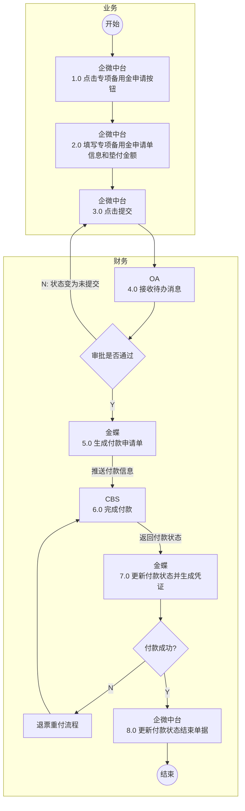
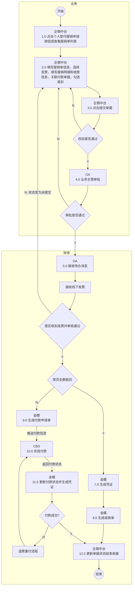

# 1.专项备用金申请流程

## Mermaid 流程图

## 流程节点说明

| 节点编号 | 节点名称 | 角色/部门 | 节点类型 | 说明 |
|---|---|---|---|---|
| - | 开始 | 业务 | 开始节点 | 流程触发起点 |
| 1.0 | 点击专项备用金申请按钮 | 业务 (企微中台) | 操作节点 | 业务人员在企微中台发起申请 |
| 2.0 | 填写专项备用金申请单信息和垫付金额 | 业务 (企微中台) | 操作节点 | 填写申请单的具体业务信息及金额 |
| 3.0 | 点击提交 | 业务 (企微中台) | 操作节点 | 提交申请单据 |
| 4.0 | 接收待办消息 | 财务 (OA) | 审批节点 | 财务在OA系统接收待办并进行审批 |
| - | 审批是否通过 | 财务 | 判断节点 | 判断OA审批结果是否通过 |
| 5.0 | 生成付款申请单 | 财务 (金蝶) | 系统节点 | 审批通过后在金蝶系统生成付款申请单 |
| 6.0 | 完成付款 | 财务 (CBS) | 系统节点 | CBS系统执行付款操作 |
| 7.0 | 更新付款状态并生成凭证 | 财务 (金蝶) | 系统节点 | 根据CBS返回的付款状态更新单据并生成财务凭证 |
| - | 付款成功? | 财务 | 判断节点 | 判断CBS付款是否成功 |
| - | 退票重付流程 | 财务 | 子流程 | 付款失败时进入退票重付处理流程 |
| 8.0 | 更新付款状态结束单据 | 财务 (企微中台) | 结束节点 | 付款成功后更新企微中台单据状态并结束流程 |
| - | 结束 | 财务 | 结束节点 | 流程结束 |

## 流程分支说明

| 起点 | 条件/操作 | 终点 | 说明 |
|---|---|---|---|
| 审批是否通过 | N (否) | 3.0 点击提交 | 审批驳回，状态变为未提交，返回业务节点重新提交 |
| 审批是否通过 | Y (是) | 5.0 生成付款申请单 | 审批通过，流转至金蝶系统生成付款单 |
| 5.0 生成付款申请单 | 推送付款信息 | 6.0 完成付款 | 金蝶向CBS推送付款指令 |
| 6.0 完成付款 | 返回付款状态 | 7.0 更新付款状态并生成凭证 | CBS向金蝶返回付款执行结果 |
| 付款成功? | N (否) | 退票重付流程 | 付款失败，进入退票重付流程，完成后重新发起付款(6.0) |
| 付款成功? | Y (是) | 8.0 更新付款状态结束单据 | 付款成功，流转至终态 |

## 待确认内容

无

---

# 2.个人垫付报销流程

## Mermaid 流程图

## 流程节点说明

| 节点编号 | 节点名称 | 角色/部门 | 节点类型 | 说明 |
|---|---|---|---|---|
| - | 开始 | 业务 | 开始节点 | 流程触发起点 |
| 1.0 | 点击个人垫付报销申请按钮或查看报销单列表 | 业务 (企微中台) | 操作节点 | 业务人员发起报销或查看列表 |
| 2.0 | 填写报销单信息... | 业务 (企微中台) | 操作节点 | 填写报销明细、收款信息、选择发票、关联付款单据并勾选抵扣 |
| 3.0 | 点击提交单据 | 业务 (企微中台) | 操作节点 | 提交报销单据 |
| - | [待确认]校验是否通过 | 业务 | 判断节点 | 系统校验单据信息是否合规 |
| 4.0 | [待确认]业务主管审批 | 业务 (OA) | 审批节点 | 业务线主管进行审批 |
| - | [待确认]审批是否通过 | 业务 | 判断节点 | 判断主管审批结果 |
| 5.0 | [待确认]接收待办消息 | 财务 (OA) | 审批节点 | 财务接收待办进行审核 |
| - | 接收线下发票 | 财务 | 操作节点 | 财务人员接收纸质/线下发票 |
| - | 是否收到发票并审核通过 | 财务 | 判断节点 | 财务确认发票收讫及审核结果 |
| - | [待确认]是否全额抵扣 | 财务 | 判断节点 | 判断报销金额是否被关联的借款/付款单据全额抵扣 |
| 7.0 | [待确认]生成凭证 | 财务 (金蝶) | 系统节点 | 全额抵扣场景下，生成相关财务凭证 |
| 8.0 |[待确认]生成收款单 | 财务 (金蝶) | 系统节点 | 全额抵扣场景下，生成收款/核销单据 |
| 9.0 | 生成付款申请单 | 财务 (金蝶) | 系统节点 | 非全额抵扣场景下，生成需支付的付款申请单 |
| 10.0 | 完成付款 | 财务 (CBS) | 系统节点 | CBS系统执行付款操作 |
| 11.0 | 更新付款状态并生成凭证 | 财务 (金蝶) | 系统节点 | 根据CBS返回状态更新单据并生成凭证 |
| - | 付款成功? | 财务 | 判断节点 | 判断CBS付款是否成功 |
| - | 退票重付流程 | 财务 | 子流程 | 付款失败时进入退票重付处理流程 |
| 12.0 | 更新单据状态结束单据 | 财务 (企微中台) | 结束节点 | 流程终态更新企微中台单据状态 |
| - | 结束 | 财务 | 结束节点 | 流程结束 |

## 流程分支说明

| 起点 | 条件/操作 | 终点 | 说明 |
|---|---|---|---|
| 校验是否通过 | N (否) | 2.0 填写报销单信息... | 校验不通过，返回修改单据 |
| 校验是否通过 | Y (是) | 4.0 业务主管审批 | 校验通过，提交至业务主管审批 |
| 审批是否通过 | N (否) | 2.0 填写报销单信息... | 主管审批驳回，返回修改单据 |
| 审批是否通过 | Y (是) | 5.0 接收待办消息 | 主管审批通过，流转至财务节点 |
| 是否收到发票并审核通过 | N (否) | 2.0 填写报销单信息... | 财务未收到发票或审核不通过，状态变为未提交，退回业务节点 |
| 是否收到发票并审核通过 | Y (是) | 是否全额抵扣 | 财务审核通过，判断是否需要实际打款 |
| 是否全额抵扣 | Y (是) | 7.0 生成凭证 | 已全额抵扣，无需付款，直接生成凭证及收款单后结束 |
| 是否全额抵扣 | N (否) | 9.0 生成付款申请单 | 未全额抵扣，需向员工支付尾款，生成付款申请单 |
| 9.0 生成付款申请单 | 推送付款信息 | 10.0 完成付款 | 金蝶向CBS推送付款指令 |
| 10.0 完成付款 | 返回付款状态 | 11.0 更新付款状态并生成凭证 | CBS向金蝶返回付款执行结果 |
| 付款成功? | N (否) | 退票重付流程 | 付款失败，进入退票重付流程，完成后重新发起付款(10.0) |
| 付款成功? | Y (是) | 12.0 更新单据状态结束单据 | 付款成功，流转至终态 |

## 待确认内容

1. **流程2 校验节点**：节点“校验是否通过”图片文字较模糊，需人工确认是否为系统校验节点。
2. **流程2 节点4.0**：图片文字模糊，初步识别为“4.0 业务主管审批”，需人工确认。
3. **流程2 节点5.0**：图片文字模糊，初步识别为“5.0 接收待办消息”或“财务初审”，需人工确认。
4. **流程2 抵扣判断节点**：图片文字模糊，初步识别为“是否全额抵扣”，需人工确认。
5. **流程2 节点7.0与8.0**：图片文字模糊，初步识别为“7.0 生成凭证”和“8.0 生成收款单”，需人工确认具体单据类型。