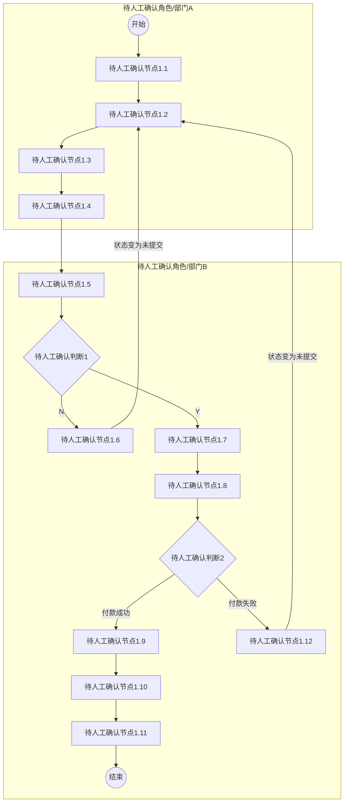
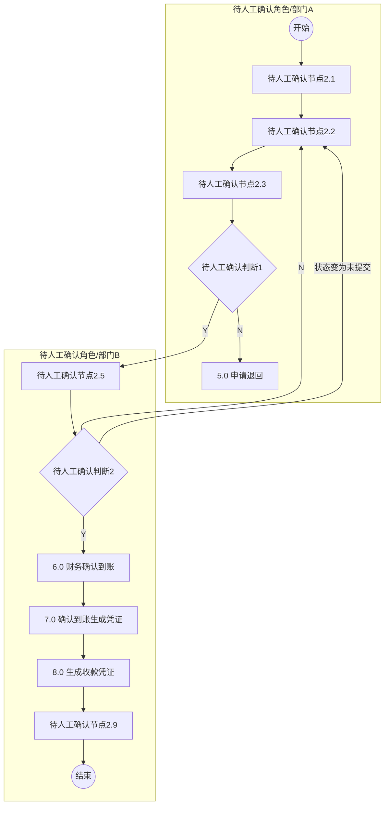

# 保证金管理流程图

## 1. 保证金付款申请流程

### Mermaid 流程图

### 流程节点说明

| 节点编号 | 节点名称 | 角色/部门 | 节点类型 | 说明 |
|---|---|---|---|---|
| Start1 | 开始 | 待人工确认角色A | 开始节点 | 流程开始 |
| Node1_1 | 待人工确认节点1.1 | 待人工确认角色A | 操作节点 | 图片模糊，待人工确认 |
| Node1_2 | 待人工确认节点1.2 | 待人工确认角色A | 操作节点 | 图片模糊，待人工确认 |
| Node1_3 | 待人工确认节点1.3 | 待人工确认角色A | 操作节点 | 图片模糊，待人工确认 |
| Node1_4 | 待人工确认节点1.4 | 待人工确认角色A | 操作节点 | 图片模糊，待人工确认 |
| Node1_5 | 待人工确认节点1.5 | 待人工确认角色B | 操作节点 | 图片模糊，待人工确认 |
| Cond1_1 | 待人工确认判断1 | 待人工确认角色B | 判断节点 | 图片模糊，待人工确认 |
| Node1_6 | 待人工确认节点1.6 | 待人工确认角色B | 操作节点 | 图片模糊，待人工确认 |
| Node1_7 | 待人工确认节点1.7 | 待人工确认角色B | 操作节点 | 图片模糊，待人工确认 |
| Node1_8 | 待人工确认节点1.8 | 待人工确认角色B | 操作节点 | 图片模糊，待人工确认 |
| Cond1_2 | 待人工确认判断2 | 待人工确认角色B | 判断节点 | 图片模糊，待人工确认 |
| Node1_9 | 待人工确认节点1.9 | 待人工确认角色B | 操作节点 | 图片模糊，待人工确认 |
| Node1_10 | 待人工确认节点1.10 | 待人工确认角色B | 操作节点 | 图片模糊，待人工确认 |
| Node1_11 | 待人工确认节点1.11 | 待人工确认角色B | 操作节点 | 图片模糊，待人工确认 |
| Node1_12 | 待人工确认节点1.12 | 待人工确认角色B | 操作节点 | 图片模糊，待人工确认 |
| End1 | 结束 | 待人工确认角色B | 结束节点 | 流程结束 |

### 流程分支说明

| 起点 | 条件/操作 | 终点 | 说明 |
|---|---|---|---|
| Cond1_1 | Y | Node1_7 | 判断通过，进入下一环节 |
| Cond1_1 | N | Node1_6 | 判断不通过，进入驳回/异常处理节点 |
| Node1_6 | 状态变为未提交 | Node1_2 | 驳回至前端节点，状态变更为未提交 |
| Cond1_2 | 付款成功 | Node1_9 | 付款成功，进入后续处理 |
| Cond1_2 | 付款失败 | Node1_12 | 付款失败，进入异常处理节点 |
| Node1_12 | 状态变为未提交 | Node1_2 | 付款失败后退回，状态变更为未提交 |

---

## 2. 保证金退回申请流程

### Mermaid 流程图

### 流程节点说明

| 节点编号 | 节点名称 | 角色/部门 | 节点类型 | 说明 |
|---|---|---|---|---|
| Start2 | 开始 | 待人工确认角色A | 开始节点 | 流程开始 |
| Node2_1 | 待人工确认节点2.1 | 待人工确认角色A | 操作节点 | 图片模糊，待人工确认 |
| Node2_2 | 待人工确认节点2.2 | 待人工确认角色A | 操作节点 | 图片模糊，待人工确认 |
| Node2_3 | 待人工确认节点2.3 | 待人工确认角色A | 操作节点 | 图片模糊，待人工确认 |
| Cond2_1 | 待人工确认判断1 | 待人工确认角色A | 判断节点 | 图片模糊，待人工确认 |
| Node2_4 | 5.0 申请退回 | 待人工确认角色A | 操作节点 | 申请退回操作 |
| Node2_5 | 待人工确认节点2.5 | 待人工确认角色B | 操作节点 | 图片模糊，待人工确认 |
| Cond2_2 | 待人工确认判断2 | 待人工确认角色B | 判断节点 | 图片模糊，待人工确认 |
| Node2_6 | 6.0 财务确认到账 | 待人工确认角色B | 操作节点 | 财务确认到账 |
| Node2_7 | 7.0 确认到账生成凭证 | 待人工确认角色B | 操作节点 | 确认到账生成凭证 |
| Node2_8 | 8.0 生成收款凭证 | 待人工确认角色B | 操作节点 | 生成收款凭证 |
| Node2_9 | 待人工确认节点2.9 | 待人工确认角色B | 操作节点 | 图片模糊，待人工确认 |
| End2 | 结束 | 待人工确认角色B | 结束节点 | 流程结束 |

### 流程分支说明

| 起点 | 条件/操作 | 终点 | 说明 |
|---|---|---|---|
| Cond2_1 | N | Node2_4 | 判断为N，进入申请退回节点 |
| Cond2_1 | Y | Node2_5 | 判断为Y，进入下一环节 |
| Cond2_2 | N / 状态变为未提交 | Node2_2 | 判断不通过，驳回至前端节点，状态变更为未提交 |
| Cond2_2 | Y | Node2_6 | 判断通过，进入财务确认到账环节 |

---

## 待确认内容

- **泳道角色名称**：两个流程图左侧的泳道（角色/部门）名称因分辨率过低无法看清，已标记为“待人工确认角色A/B”。
- **节点具体文本**：流程图1中绝大多数节点文本、判断条件文本模糊不清；流程图2中前半部分节点文本模糊不清。为避免猜测导致业务逻辑错误，均已使用“待人工确认节点/判断”进行占位标记，需提供高清原图或由人工核对补充。