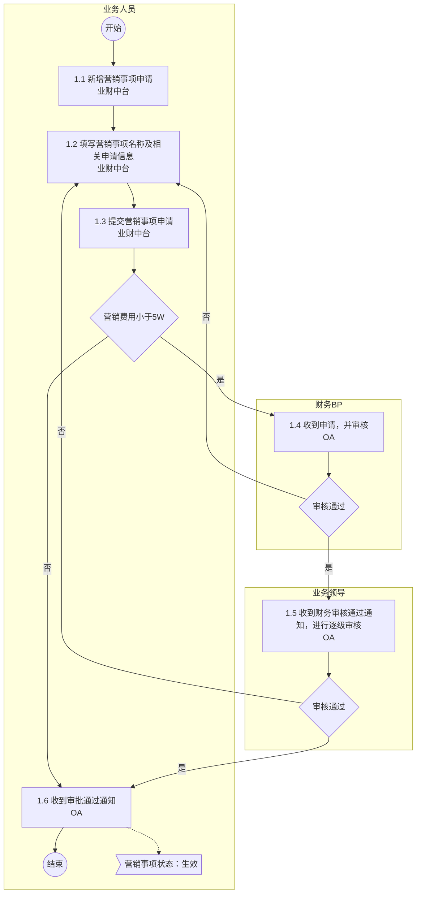
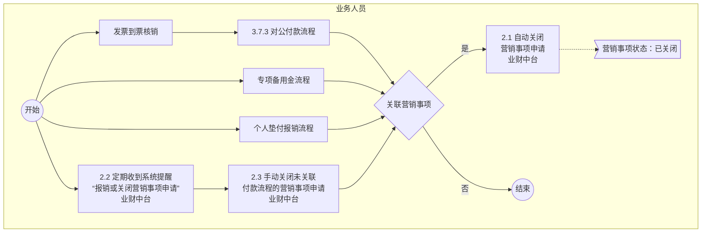

# 3.7.5.1 营销事项管理 流程图

## 1. 申请营销事项

### Mermaid 流程图

### 流程节点说明

| 节点编号 | 节点名称 | 角色/部门 | 节点类型 | 说明 |
|---|---|---|---|---|
| Start1 | 开始 | 业务人员 | 开始节点 | 流程开始 |
| Node1_1 | 1.1 新增营销事项申请 | 业务人员 | 操作节点 | 所属系统：业财中台 |
| Node1_2 | 1.2 填写营销事项名称及相关申请信息 | 业务人员 | 操作节点 | 所属系统：业财中台 |
| Node1_3 | 1.3 提交营销事项申请 | 业务人员 | 操作节点 | 所属系统：业财中台 |
| Cond1_1 | 营销费用小于5W | 业务人员 | 判断节点 | 判断营销费用金额是否小于5W |
| Node1_4 | 1.4 收到申请，并审核 | 财务BP | 审批节点 | 所属系统：OA |
| Cond1_2 | 审核通过 | 财务BP | 判断节点 | 财务BP审核判断 |
| Node1_5 | 1.5 收到财务审核通过通知，进行逐级审核 | 业务领导 | 审批节点 | 所属系统：OA |
| Cond1_3 | 审核通过 | 业务领导 | 判断节点 | 业务领导审核判断 |
| Node1_6 | 1.6 收到审批通过通知 | 业务人员 | 操作节点 | 所属系统：OA。生成结果：营销事项状态变更为“生效” |
| End1 | 结束 | 业务人员 | 结束节点 | 流程结束 |

### 流程分支说明

| 起点 | 条件/操作 | 终点 | 说明 |
|---|---|---|---|
| Cond1_1 | 否 | Node1_6 | 营销费用不小于5W，直接流转至收到审批通过通知 |
| Cond1_1 | 是 | Node1_4 | 营销费用小于5W，流转至财务BP进行审核 |
| Cond1_2 | 否 | Node1_2 | 财务BP审核不通过，驳回至业务人员重新填写申请信息 |
| Cond1_2 | 是 | Node1_5 | 财务BP审核通过，流转至业务领导进行逐级审核 |
| Cond1_3 | 否 | Node1_2 | 业务领导审核不通过，驳回至业务人员重新填写申请信息 |
| Cond1_3 | 是 | Node1_6 | 业务领导审核通过，流转至收到审批通过通知 |

---

## 2. 关闭营销事项

### Mermaid 流程图

### 流程节点说明

| 节点编号 | 节点名称 | 角色/部门 | 节点类型 | 说明 |
|---|---|---|---|---|
| Start2 | 开始 | 业务人员 | 开始节点 | 流程开始 |
| Node2_1 | 发票到票核销 | 业务人员 | 操作节点 | - |
| Node2_2 | 3.7.3 对公付款流程 | 业务人员 | 流程引用 | 引用对公付款流程 |
| Node2_3 | 专项备用金流程 | 业务人员 | 流程引用 | 引用专项备用金流程 |
| Node2_4 | 个人垫付报销流程 | 业务人员 | 流程引用 | 引用个人垫付报销流程 |
| Node2_5 | 2.2 定期收到系统提醒“报销或关闭营销事项申请” | 业务人员 | 操作节点 | 所属系统：业财中台 |
| Node2_6 | 2.3 手动关闭未关联付款流程的营销事项申请 | 业务人员 | 操作节点 | 所属系统：业财中台 |
| Cond2_1 | 关联营销事项 | 业务人员 | 判断节点 | 判断是否关联了营销事项 |
| Node2_7 | 2.1 自动关闭营销事项申请 | 业务人员 | 操作节点 | 所属系统：业财中台。生成结果：营销事项状态变更为“已关闭” |
| End2 | 结束 | 业务人员 | 结束节点 | 流程结束 |

### 流程分支说明

| 起点 | 条件/操作 | 终点 | 说明 |
|---|---|---|---|
| Start2 | - | Node2_1 | 并行分支：进入发票到票核销流程 |
| Start2 | - | Node2_3 | 并行分支：进入专项备用金流程 |
| Start2 | - | Node2_4 | 并行分支：进入个人垫付报销流程 |
| Start2 | - | Node2_5 | 并行分支：触发定期系统提醒 |
| Node2_2 | - | Cond2_1 | 对公付款流程结束后，进入关联营销事项判断 |
| Node2_3 | - | Cond2_1 | 专项备用金流程结束后，进入关联营销事项判断 |
| Node2_4 | - | Cond2_1 | 个人垫付报销流程结束后，进入关联营销事项判断 |
| Node2_6 | - | Cond2_1 | 手动关闭操作后，进入关联营销事项判断 |
| Cond2_1 | 是 | Node2_7 | 若关联了营销事项，则执行自动关闭营销事项申请 |
| Cond2_1 | 否 | End2 | 若未关联营销事项，则直接结束流程 |

---

## 待确认内容

无