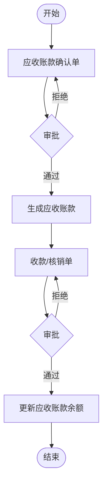
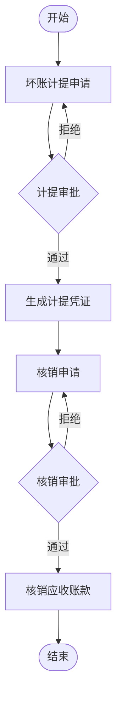

# 应收账款管理 流程图
- 原始文件路径：/home/keith/projects/marketing-fee-control/docs/source/03 详细设计/3.7页面详细设计/3.7.8应收账款管理界面目录/应收账款管理 流程图.pdf
- 输出文件路径：/home/keith/projects/marketing-fee-control/docs/prd/页面详细设计/3.7.8应收账款管理界面目录/应收账款管理 流程图.md
- 页数：2
- 识别说明：本文件由 PDF 流程图识别生成，已忽略 logo、装饰元素和无业务意义的图片内容。

## 第 1 页：营销应收账款流程图
### Mermaid 流程图

### 流程节点说明
| 节点编号 | 节点名称 | 角色/部门 | 节点类型 | 说明 |
| ---- | ---- | ----- | ---- | -- |
| 1 | 应收账款确认单 | 业务员 | 任务 | 录入应收账款信息 |
| 2 | 审批 | 部门主管/财务 | 判断 | 对确认单进行审核 |
| 3 | 生成应收账款 | 系统 | 任务 | 审核通过后自动生成应收账款记录 |
| 4 | 收款/核销单 | 财务 | 任务 | 录入实际收款或进行坏账核销申请 |
| 5 | 审批 | 财务主管 | 判断 | 对核销或收款单进行审核 |
| 6 | 更新应收账款余额 | 系统 | 任务 | 审核通过后核减应收账款余额 |

### 流程分支说明
| 起点 | 条件/操作 | 终点 | 说明 |
| -- | ----- | -- | -- |
| 审批 | 拒绝 | 应收账款确认单 | 返回修改 |
| 审批 | 通过 | 生成应收账款 | 进入台账管理 |
| 审批 | 拒绝 | 收款/核销单 | 返回修改 |
| 审批 | 通过 | 更新应收账款余额 | 完成闭环 |

### 待确认内容
* 无

## 第 2 页：坏账计提及核销流程
### Mermaid 流程图

### 流程节点说明
| 节点编号 | 节点名称 | 角色/部门 | 节点类型 | 说明 |
| ---- | ---- | ----- | ---- | -- |
| 1 | 坏账计提申请 | 财务 | 任务 | 根据政策申请坏账准备计提 |
| 2 | 计提审批 | 财务总监 | 判断 | 审核计提额度合理性 |
| 3 | 生成计提凭证 | 系统 | 任务 | 财务过账 |
| 4 | 核销申请 | 业务部门 | 任务 | 确认无法收回，申请核销 |
| 5 | 核销审批 | 财务/高管 | 判断 | 审核核销合规性 |
| 6 | 核销应收账款 | 系统 | 任务 | 冲减原应收账款及坏账准备 |

### 流程分支说明
| 起点 | 条件/操作 | 终点 | 说明 |
| -- | ----- | -- | -- |
| 计提审批 | 通过 | 生成计提凭证 | 确认坏账准备 |
| 计提审批 | 拒绝 | 坏账计提申请 | 调整计提方案 |
| 核销审批 | 通过 | 核销应收账款 | 正式结案 |
| 核销审批 | 拒绝 | 核销申请 | 继续催收 |

### 待确认内容
* 无
