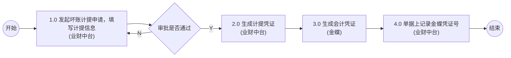
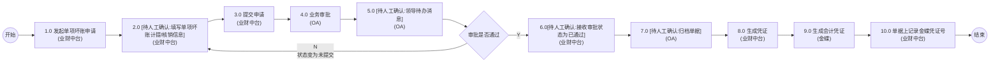

# 应收账款管理 流程图

## 1. 通用坏账计提申请流程

### Mermaid 流程图

### 流程节点说明

| 节点编号 | 节点名称 | 角色/系统 | 节点类型 | 说明 |
|---|---|---|---|---|
| - | 开始 | 财务 | 起点 | 流程开始 |
| 1.0 | 发起坏账计提申请，填写计提信息 | 业财中台 | 操作节点 | - |
| - | 审批是否通过 | - | 判断节点 | - |
| 2.0 | 生成计提凭证 | 业财中台 | 操作节点 | - |
| 3.0 | 生成会计凭证 | 金蝶 | 操作节点 | - |
| 4.0 | 单据上记录金蝶凭证号 | 业财中台 | 操作节点 | - |
| - | 结束 | 财务 | 终点 | 流程结束 |

### 流程分支说明

| 起点 | 条件/操作 | 终点 | 说明 |
|---|---|---|---|
| 审批是否通过 | N | 1.0 发起坏账计提申请，填写计提信息 | 审批未通过，返回重新填写申请 |
| 审批是否通过 | Y | 2.0 生成计提凭证 | 审批通过，流转至下一环节 |

### 待确认内容

无

---

## 2. 单项坏账申请流程

### Mermaid 流程图

### 流程节点说明

| 节点编号 | 节点名称 | 角色/系统 | 节点类型 | 说明 |
|---|---|---|---|---|
| - | 开始 | 财务 | 起点 | 流程开始 |
| 1.0 | 发起单项坏账申请 | 业财中台 | 操作节点 | - |
| 2.0 |[待人工确认:填写单项坏账计提/核销信息] | 业财中台 | 操作节点 | 图片模糊，需人工核对具体文字 |
| 3.0 | 提交申请 | 业财中台 | 操作节点 | - |
| 4.0 | 业务审批 | OA | 审批节点 | - |
| 5.0 | [待人工确认:领导待办消息] | OA | 操作节点 | 图片模糊，需人工核对具体文字 |
| - | 审批是否通过 | - | 判断节点 | - |
| 6.0 | [待人工确认:接收审批状态为已通过] | 业财中台 | 操作节点 | 图片模糊，需人工核对具体文字 |
| 7.0 | [待人工确认:归档单据] | OA | 操作节点 | 图片模糊，需人工核对具体文字 |
| 8.0 | 生成凭证 | 业财中台 | 操作节点 | - |
| 9.0 | 生成会计凭证 | 金蝶 | 操作节点 | - |
| 10.0 | 单据上记录金蝶凭证号 | 业财中台 | 操作节点 | - |
| - | 结束 | 财务 | 终点 | 流程结束 |

### 流程分支说明

| 起点 | 条件/操作 | 终点 | 说明 |
|---|---|---|---|
| 审批是否通过 | N | 2.0[待人工确认:填写单项坏账计提/核销信息] | 审批未通过，状态变为未提交，返回重新填写 |
| 审批是否通过 | Y | 6.0 [待人工确认:接收审批状态为已通过] | 审批通过，流转至下一环节 |

### 待确认内容

1. 节点 2.0 的具体文本内容模糊，初步识别为“填写单项坏账计提/核销信息”，待人工确认。
2. 节点 5.0 的具体文本内容模糊，初步识别为“领导待办消息”，待人工确认。
3. 节点 6.0 的具体文本内容模糊，初步识别为“接收审批状态为已通过”，待人工确认。
4. 节点 7.0 的具体文本内容模糊，初步识别为“归档单据”，待人工确认。